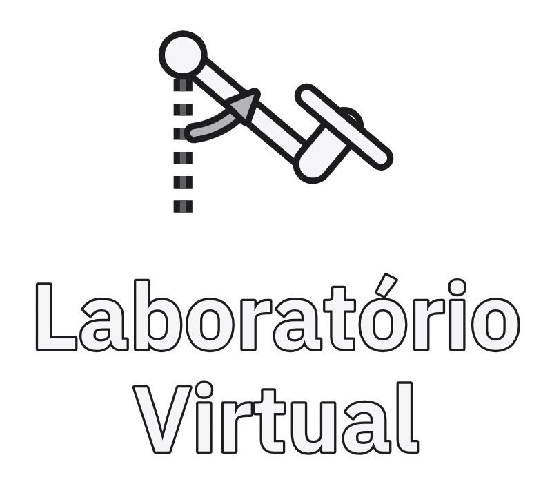

<p align="center">
  
</p>

<p align="center">
  <strong>Plataforma didática para modelagem, identificação e controle de sistemas dinâmicos</strong><br>
  <sub>Universidade Federal do Pará · Campus Universitário de Tucuruí · Faculdade de Engenharia Elétrica</sub>
</p>

<p align="center">
  <a href="https://oseiasdfarias.github.io/lab-virtual/"></a>
  
  
</p>

---

## Resumo

Este repositório reúne o resultado de um Trabalho de Conclusão de Curso em Engenharia
Elétrica cujo objetivo foi construir uma plataforma completa — física e computacional —
para o ensino e a experimentação em modelagem e controle de sistemas dinâmicos.

O sistema adotado como planta é um **aeropêndulo**: uma haste articulada em um pivô, com
um motor CC e hélice acoplados à extremidade. O empuxo gerado pela hélice produz torque em
torno do pivô e eleva a haste a partir do repouso; a variável controlada é o ângulo da
haste em relação à vertical. É uma planta de primeira escolha para ensino por ser
não linear, instável em malha aberta em parte da faixa de operação e de construção
acessível.

A plataforma cobre o ciclo experimental completo: **excitação e aquisição** de dados no
protótipo real, **identificação do modelo** a partir desses dados, **projeto e validação do
controlador**, e **simulação** em um gêmeo digital que reproduz a dinâmica identificada.

## Arquitetura

O sistema é composto por quatro subsistemas que operam de forma integrada:

| Subsistema | Função | Tecnologia |
| --- | --- | --- |
| **Protótipo** | Planta física: haste, motor CC com hélice, potenciômetro como sensor de ângulo, ponte H | Estrutura em madeira e fibra de carbono |
| **Firmware** | Leitura do sensor, controle PID em malha fechada, geração do sinal de referência e comunicação serial | C++ · ESP32 TTGO · PlatformIO |
| **Interface gráfica** | Aquisição em tempo real, visualização dos sinais e registro dos ensaios em CSV | Python · CustomTkinter · PySerial |
| **Gêmeo digital** | Simulação da dinâmica identificada, com animação tridimensional e gráficos | Python · VPython · Matplotlib |

O firmware e a interface gráfica trocam dados por porta serial: o microcontrolador envia
posição angular, referência, erro e sinal de controle; a interface envia comandos de
configuração, ganhos do controlador e parâmetros do sinal de excitação.

## Metodologia

A obtenção do modelo seguiu a abordagem de **identificação de sistemas** a partir de dados
experimentais, em vez de modelagem exclusivamente analítica:

1. **Excitação** — aplicação de sinal PRBS (*Pseudo-Random Binary Sequence*) na entrada do
   sistema, com nível de offset ajustado para manter a operação em torno do ponto de
   trabalho desejado.
2. **Aquisição** — registro dos pares entrada–saída pela interface gráfica, com divisão do
   conjunto em dados de treino e de teste.
3. **Estimação** — ajuste dos parâmetros do modelo pelo método dos **mínimos quadrados**.
4. **Conversão e validação** — passagem do modelo discreto para o contínuo pela
   transformação de Tustin e verificação da aderência frente aos dados de teste.
5. **Controle** — projeto do controlador a partir do modelo identificado e avaliação em
   malha fechada, tanto no gêmeo digital quanto no protótipo real.

Uma dedução analítica do modelo, por subsistemas (motor CC e braço), também está
documentada e serve de referência comparativa para o modelo identificado.

## Estrutura do repositório

```
.
├── brand/                      # Identidade visual (SVG, PNG e scripts geradores)
├── docs/                       # Fonte do site de documentação (MkDocs)
├── docs_tcc/                   # Resumos e índice do projeto para consulta rápida
├── materiais_complementares/   # Bibliografia, estudos de identificação e modelagem
├── revisao_tcc/                # Monografia em LaTeX e versões de revisão
├── softwares_aeropendulo/      # Interface gráfica, gêmeo digital e firmware
└── utils/                      # Figuras e diagramas
```

## Instalação e execução

Requer Python 3.8 a 3.12. As dependências são gerenciadas por [Poetry](https://python-poetry.org/):

```bash
git clone https://github.com/Oseiasdfarias/lab-virtual.git
cd lab-virtual/softwares_aeropendulo
poetry install
poetry run python rungui.py
```

O firmware está em `softwares_aeropendulo/firmwares_microcontroladores/`. A variante mais
completa é `PlatformIo/Esp32_ttgo_modulos`, organizada em bibliotecas separadas para
controlador PID, conversão de unidades, geração de referência e comunicação serial.
Compilação e gravação pelo PlatformIO:

```bash
cd softwares_aeropendulo/firmwares_microcontroladores/PlatformIo/Esp32_ttgo_modulos
pio run --target upload
```

A interface gráfica pode ser utilizada sem o protótipo: o gêmeo digital opera de forma
autônoma, o que permite usar a plataforma em aulas mesmo sem acesso ao hardware.

## Documentação

A documentação técnica está publicada em
**[oseiasdfarias.github.io/lab-virtual](https://oseiasdfarias.github.io/lab-virtual/)** e
inclui guias de instalação e a referência dos módulos do gêmeo digital.

Para uma visão consolidada do projeto — resumo por capítulo da monografia, arquitetura do
software, catálogo dos materiais complementares e pendências —, consulte
[`docs_tcc/`](./docs_tcc/), que traz um índice em YAML e resumos em Markdown.

## Como citar

```bibtex
@mastersthesis{farias2023labvirtual,
  author       = {Oséias Farias},
  title        = {Desenvolvimento de Protótipo e Gêmeo Digital como Ferramenta para um
                  Laboratório Virtual com Foco em Modelagem e Controle de Sistemas Dinâmicos},
  school       = {Universidade Federal do Pará, Campus Universitário de Tucuruí},
  type         = {Trabalho de Conclusão de Curso},
  address      = {Tucuruí, Brasil},
  year         = {2023},
  url          = {https://github.com/Oseiasdfarias/lab-virtual}
}
```

## Autoria

Desenvolvido por **Oséias Farias**, discente da Faculdade de Engenharia Elétrica da
UFPA — Campus Universitário de Tucuruí, sob orientação do **Prof. Raphael Teixeira**.

<p align="center">
  
</p>
