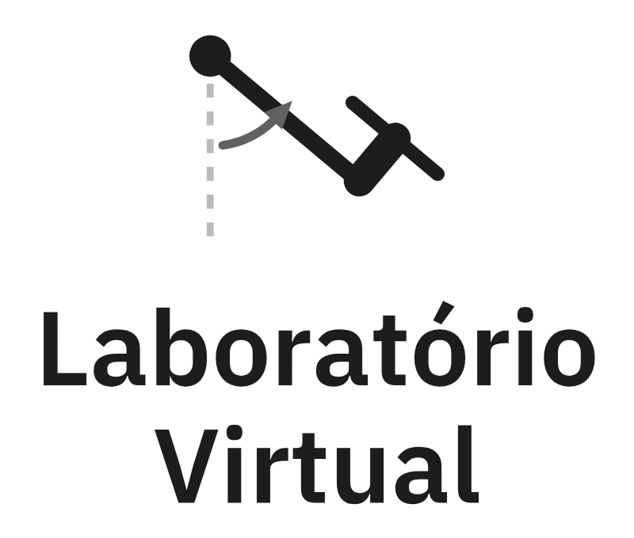
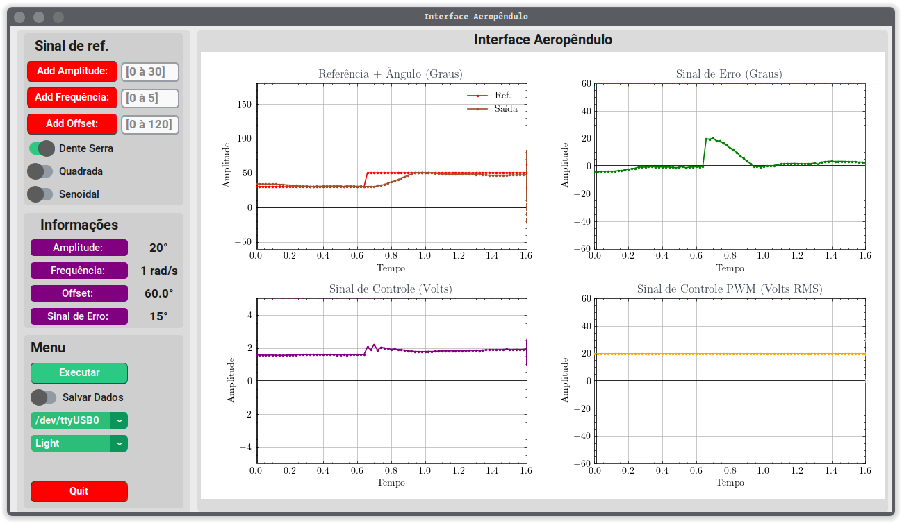
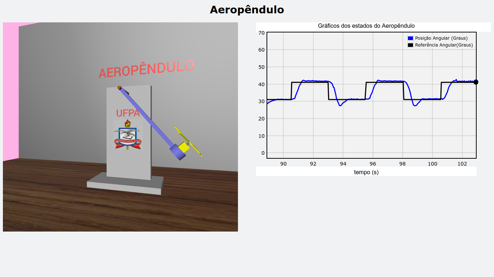
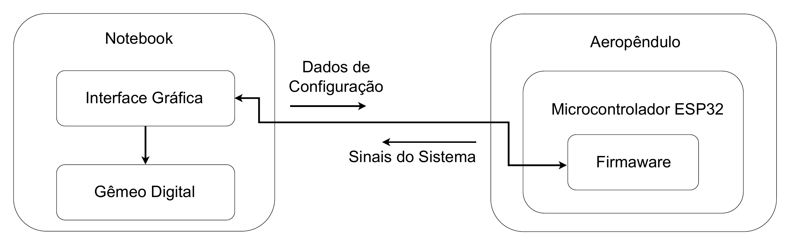
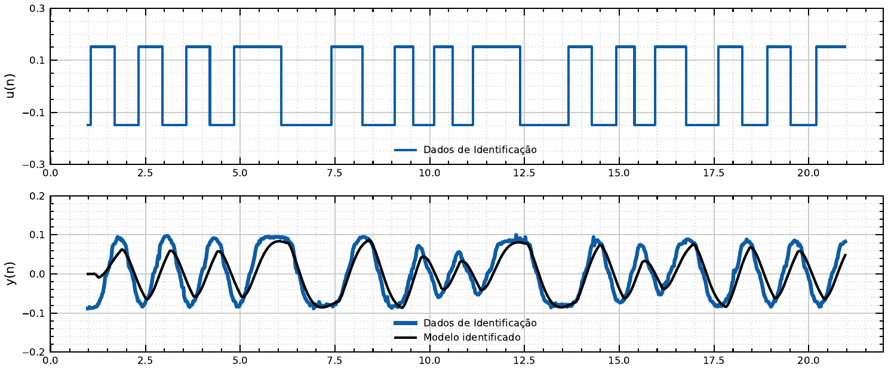

<p align="center">
  <picture>
    <source media="(prefers-color-scheme: dark)" srcset="./brand/png/logo-vertical-800.png">
    
  </picture>
</p>

<p align="center">
  <strong>Protótipo físico, gêmeo digital e identificação de sistemas aplicados a um aeropêndulo</strong><br>
  <sub>Uma plataforma aberta para estudar modelagem, identificação e controle de sistemas dinâmicos</sub>
</p>

<p align="center">
  <a href="https://oseiasdfarias.github.io/lab-virtual/"></a>
  <a href="https://github.com/Oseiasdfarias/lab-virtual/actions/workflows/docs.yml"></a>
  <a href="https://bdm.ufpa.br/handle/prefix/6944"></a>
  
  
</p>

<p align="center">
  <a href="https://oseiasdfarias.github.io/lab-virtual/">Documentação</a> ·
  <a href="#resultados">Resultados</a> ·
  <a href="#reprodutibilidade">Como reproduzir</a> ·
  <a href="#como-citar">Como citar</a>
</p>

<table>
  <tr>
    <td width="33%"></td>
    <td width="33%"></td>
    <td width="33%"></td>
  </tr>
  <tr>
    <td align="center"><sub><b>Protótipo</b> — planta física</sub></td>
    <td align="center"><sub><b>Interface gráfica</b> — aquisição e ensaios</sub></td>
    <td align="center"><sub><b>Gêmeo digital</b> — réplica 3D</sub></td>
  </tr>
</table>

## Resumo

Ensinar controle esbarra na distância entre o sistema físico e a sua descrição matemática.
Este repositório reúne uma plataforma que encurta essa distância: um **aeropêndulo** real —
uma haste articulada erguida pelo empuxo de uma hélice —, um **firmware** que fecha a malha
de controle num ESP32, uma **interface gráfica** para conduzir ensaios e registrar dados, e um
**gêmeo digital** que reproduz em 3D o movimento medido. Sobre essa plataforma foi percorrido
o ciclo experimental completo: modelagem a partir da física, **identificação de sistemas**
com excitação PRBS e mínimos quadrados, e **controle PID** avaliado em malha fechada no
protótipo.

O trabalho foi desenvolvido como Trabalho de Conclusão de Curso em Engenharia Elétrica
(UFPA, 2023) e é mantido como material aberto de ensino e pesquisa.

### Destaques

- **Ciclo experimental completo**, do protótipo ao controlador, com código, firmware e dados de ensaio abertos.
- **Modelo ARX de 10ª ordem** com **78,3 % de ajuste NRMSE** nos dados de validação *(análise posterior à monografia, reproduzível por script)*.
- **Laço de controle embarcado** a 20 ms, independente do computador; a serial carrega só estado e configuração.
- **9 ensaios** gravados em CSV, com formato documentado, prontos para novas análises.

## A planta

O aeropêndulo é uma haste articulada num pivô, com um **motor CC série** e uma hélice na
extremidade. O empuxo gera torque em torno do pivô e ergue a haste a partir do repouso; a
variável controlada é o ângulo $\theta$ em relação à vertical, medido por um potenciômetro.
O motor é acionado por PWM através de uma ponte H (L298N).

Pelo balanço de torques, com a tensão $V$ do motor como entrada:

```math
K_m V = J\ddot{\theta} + c\,\dot{\theta} + m g d \sin\theta
```

Linearizando em torno do repouso ($\sin\theta \approx \theta$) e aplicando a transformada de
Laplace, com os parâmetros abaixo:

```math
G(s) = \frac{\theta(s)}{V(s)} = \frac{K_m/J}{s^2 + (c/J)\,s + mgd/J} = \frac{2{,}792}{s^2 + 0{,}717\,s + 9{,}985}
```

Os polos ficam em −0,358 ± 3,139j: a planta linearizada é **estável e pouco amortecida**
(frequência natural $\omega_n$ ≈ 3,16 rad/s e amortecimento $\zeta$ ≈ 0,11), com ganho estático
de ≈ 0,28 rad/V.

<details>
<summary><b>Parâmetros do modelo</b></summary>

| Símbolo | Descrição | Valor |
| :---: | --- | --- |
| $K_m$ | Ganho entre tensão do motor e torque | 0,0296 N·m/V |
| $J$ | Momento de inércia do braço | 0,0106 kg·m² |
| $c$ | Amortecimento viscoso do pivô | 0,0076 N·m·s/rad |
| $m$ | Massa | 0,36 kg |
| $d$ | Distância do pivô ao centro de massa | 0,03 m |
| $g$ | Aceleração da gravidade | 9,8 m/s² |

Valores do notebook `softwares_aeropendulo/simulador_aeropendulo/docs/Modelagem_matematica_do_aeropendulo.ipynb`.
A monografia usa uma formulação equivalente em que $K_m$ relaciona a velocidade do motor ao
empuxo; a dedução completa, incluindo o modelo do motor CC série, está na
[documentação](https://oseiasdfarias.github.io/lab-virtual/modelagem/).
</details>

## Arquitetura experimental

<p align="center">
  
</p>

| Subsistema | Papel | Tecnologia |
| --- | --- | --- |
| **Protótipo** | Planta física: haste, motor CC série com hélice, potenciômetro, ponte H | Compensado e fibra de carbono |
| **Firmware** | Lê o ângulo, gera a referência (ou o PRBS), executa o PID e aciona o motor por PWM | C++ · ESP32 TTGO · PlatformIO |
| **Interface gráfica** | Configura os ensaios, plota os sinais em tempo real e grava os dados | Python · CustomTkinter · PySerial |
| **Gêmeo digital** | Reproduz em 3D o movimento medido, a partir do ângulo recebido | Python · VPython · Matplotlib |

- **Tempo real no firmware.** O laço sensor → PID → PWM roda a cada $T_s = 20$ ms no ESP32 e
  não depende do computador; o PWM opera a 500 Hz com 8 bits.
- **Protocolo serial (115200 baud).** A cada amostra o firmware envia 7 valores (referência,
  ângulo, erro, sinal de controle, entrada, entrada, tempo); a interface envia apenas
  configuração — amplitude, frequência, offset, forma de onda, modo de malha e início do
  ensaio. Os ganhos do PID são fixos no código.

## Metodologia

### Excitação e aquisição

Em malha aberta, a entrada do sistema recebe um sinal **PRBS** (frequência máxima de 0,4 Hz,
amplitude de 0,3 V) somado a um offset de 1 V, que mantém a planta em torno do ponto de
operação. O ensaio é amostrado a 0,02 s e dividido em cerca de **60 % para identificação** (2404
amostras) e **40 % para validação** (1554 amostras); a estimação só enxerga o primeiro trecho.

### Estimação ARX por mínimos quadrados

O modelo discreto adotado é um ARX de 10ª ordem:

```math
y[k] = \sum_{i=1}^{10} a_i\, y[k-i] + \sum_{j=0}^{3} b_j\, u[k-j]
```

Os 14 coeficientes são obtidos pela solução de mínimos quadrados ordinários
$\hat{\theta} = (M^\top M)^{-1} M^\top y$, em que cada linha da matriz de regressores $M$ reúne
as saídas e entradas passadas. Um modelo de 2ª ordem, com a mesma ordem do modelo físico, foi
testado antes e se mostrou insuficiente.

### Validação

O modelo é simulado em regime livre com a entrada do ensaio e comparado à saída medida no
trecho de validação, pelo índice

```math
\text{NRMSE} = \left(1 - \frac{\lVert y - \hat{y} \rVert}{\lVert y - \bar{y} \rVert}\right) \times 100\,\%
```

### Controle

O firmware implementa um PID discreto com derivada sobre a medida (evita o *derivative kick*
em mudanças bruscas de referência):

```math
u[k] = K_p\, e[k] + K_i\, T_s \sum_{n=0}^{k} e[n] + K_d\, \frac{\theta[k-1] - \theta[k]}{T_s}
```

com $K_p$ = 0,02, $K_i$ = 0,055 e $K_d$ = 0,35, **sintonizados por tentativa e erro**
diretamente no protótipo. A malha foi avaliada com referências em onda quadrada (0,5 Hz,
15°, offset de 1 V) e dente de serra.

## Resultados

### Identificação

| Modelo | NRMSE (validação) | RMSE |
| --- | :---: | :---: |
| ARX de 2ª ordem | 51,35 % | 1,62° |
| ARX de 10ª ordem — como publicado na monografia | 55,97 % | 1,47° |
| **ARX de 10ª ordem — simulado como estimado** | **78,30 %** | **0,72°** |

<p align="center">
  
  <br><sub>Saída medida × saída simulada do modelo de 10ª ordem (figura da monografia).</sub>
</p>

> [!NOTE]
> A função de transferência de 10ª ordem da monografia foi montada com
> `control.tf([b0, …, b3], [1, -a1, …, -a10])`, que o python-control interpreta em potências
> positivas de $z$ — isso acrescenta 7 amostras (0,14 s) de atraso ao modelo estimado. As
> métricas foram calculadas depois da defesa, a partir do mesmo CSV, com coeficientes idênticos
> aos do notebook original. Detalhes na
> [página de validação](https://oseiasdfarias.github.io/lab-virtual/identificacao/validacao/).

### Malha fechada

<p align="center">
  
  <br><sub>Ensaio em malha fechada com referência em onda quadrada, registrado na interface gráfica (figura da monografia).</sub>
</p>

Nas duas referências, o ângulo medido acompanha o sinal desejado e o erro tende a zero em
regime, como esperado da ação integral; nas transições da referência aparece o transitório
típico de uma resposta ao degrau.

## Limitações

- A avaliação em malha fechada é **qualitativa**: sobressinal, tempo de acomodação e erro em regime não foram medidos.
- A figura e a função de transferência de 10ª ordem da monografia incluem o **atraso espúrio** descrito acima.
- O termo derivativo do firmware foi corrigido depois da defesa; os ganhos foram ajustados com a versão anterior e **a correção ainda não foi validada no protótipo**.
- O gêmeo digital **espelha** o ângulo medido; ele não integra um modelo da planta de forma independente.

## Reprodutibilidade

**Software** (Python 3.10 ou 3.11, dependências gerenciadas por [Poetry](https://python-poetry.org/)):

```bash
git clone https://github.com/Oseiasdfarias/lab-virtual.git
cd lab-virtual/softwares_aeropendulo
poetry install
poetry run python rungui.py               # interface gráfica
poetry run python rungui.py -simular sim  # interface + gêmeo digital
```

A interface e o gêmeo digital exibem os dados recebidos pela serial, então precisam do protótipo conectado com o firmware gravado.

**Firmware** (ESP32 TTGO, [PlatformIO](https://platformio.org/)):

```bash
cd softwares_aeropendulo/firmwares_microcontroladores/PlatformIo/Esp32_ttgo_modulos
pio run --target upload
```

**Dados e métricas.** Os ensaios estão em `softwares_aeropendulo/src_interface/dados_de_ensaio/`
(formato descrito no [README da pasta](./softwares_aeropendulo/src_interface/dados_de_ensaio/README.md)).
Para refazer a identificação e as métricas da tabela acima, a partir da raiz do repositório:

```bash
uv run --with numpy --with pandas --with control python \
  materiais_complementares/Identificacao_de_Sistemas/identificacao_aeropendulo/ident_up/metricas_validacao.py
```

**Documentação** (publicada automaticamente a cada push na `main`):

```bash
pip install -r requirements-docs.txt
mkdocs serve
```

## Estrutura do repositório

```
.
├── softwares_aeropendulo/      # Interface gráfica, gêmeo digital, firmware e dados de ensaio
├── docs/                       # Site de documentação (MkDocs Material)
├── revisao_tcc/                # Monografia em LaTeX e versões de revisão
├── materiais_complementares/   # Notebooks de identificação e modelagem, bibliografia, prototipagem
├── docs_tcc/                   # Resumos por capítulo, pendências e plano de publicações
├── brand/                      # Identidade visual (SVG, PNG e scripts geradores)
└── utils/                      # Figuras e diagramas avulsos
```

## Como citar

A monografia está em acesso aberto na Biblioteca Digital de Monografias da UFPA:
**[bdm.ufpa.br/handle/prefix/6944](https://bdm.ufpa.br/handle/prefix/6944)** (defendida em 11/12/2023).

```bibtex
@mastersthesis{farias2023labvirtual,
  author  = {Farias, Oséias Dias de},
  title   = {Desenvolvimento de protótipo e gêmeo digital como ferramenta para um
             laboratório virtual com foco em modelagem e controle de sistemas dinâmicos},
  school  = {Universidade Federal do Pará},
  type    = {Trabalho de Conclusão de Curso (Bacharelado em Engenharia Elétrica)},
  address = {Tucuruí, Brasil},
  year    = {2023},
  url     = {https://bdm.ufpa.br/handle/prefix/6944}
}
```

<details>
<summary><b>Abstract</b></summary>

*This work presents a comprehensive virtual laboratory for the study of control systems, which
combines the integration of a physical prototype, 3D simulator and an interactive graphical
interface. The motivation for this project lies in the intrinsic complexity associated with
understanding control systems, which often presents challenges, especially for students who
need to overcome the barrier of abstracting physical systems in terms of mathematical
equations. To develop the project, an Aeropendulum prototype was implemented, complete with a
set of software that allows the user to interact with the physical system, enabling the user to
make changes to the system's parameters in real time. In addition, a digital twin was developed
to mirror the dynamics of the Aeropendulum prototype using a 3D simulator. Finally, tests were
carried out to validate the laboratory, including: application of system identification using
discrete transfer function and least squares and closed loop testing with a PID controller.*

**Keywords:** aeropendulum · system identification · prototype · simulator · digital twin
</details>

## Autoria

Desenvolvido por **[Oséias Dias de Farias](https://github.com/Oseiasdfarias)** no Bacharelado em
Engenharia Elétrica da Faculdade de Engenharia Elétrica — UFPA, Campus Universitário de
Tucuruí, sob orientação do **[Prof. Raphael Barros Teixeira](https://github.com/raphateixeira)**.

<p align="center">
  
</p>
