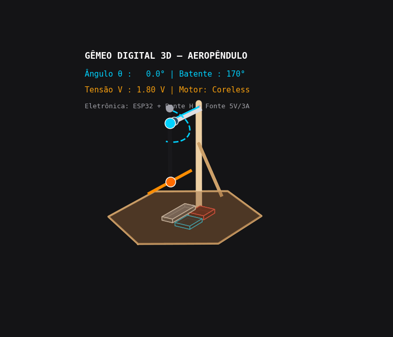
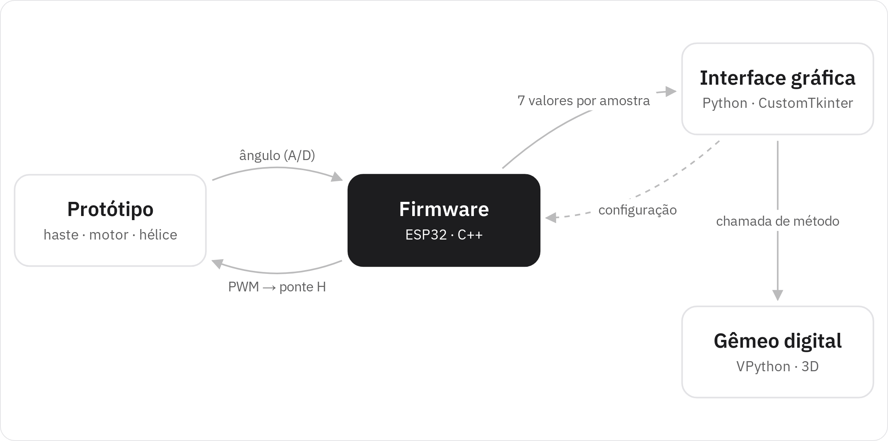

<p align="center">
  <picture>
    <source media="(prefers-color-scheme: dark)" srcset="./brand/png/logo-vertical-800.png">
    
  </picture>
</p>

<p align="center">
  <strong>Protótipo físico, gêmeo digital e identificação de sistemas aplicados a um aeropêndulo</strong><br>
  <sub>Uma plataforma aberta para estudar modelagem, identificação e controle de sistemas dinâmicos</sub>
</p>

<p align="center">
  <a href="https://oseiasdfarias.github.io/lab-virtual/"></a>
  <a href="https://github.com/Oseiasdfarias/lab-virtual/actions/workflows/docs.yml"></a>
  <a href="https://bdm.ufpa.br/handle/prefix/6944"></a>
</p>

<p align="center">
  
  
  
  
  
  
  
  
  
  
  
  
  
  
</p>

<p align="center">
  <a href="#sobre-a-plataforma">Sobre</a> ·
  <a href="#como-funciona">Como funciona</a> ·
  <a href="#começando">Começando</a> ·
  <a href="https://oseiasdfarias.github.io/lab-virtual/">Documentação</a> ·
  <a href="#publicação">Publicação</a>
</p>

<table>
  <tr>
    <td width="33%"></td>
    <td width="33%"></td>
    <td width="33%"><a href="https://oseiasdfarias.github.io/lab-virtual/assets/simulador/aeropendulo_3d.html"></a></td>
  </tr>
  <tr>
    <td align="center"><sub><b>Protótipo</b> — planta física</sub></td>
    <td align="center"><sub><b>Interface gráfica</b> — aquisição e ensaios</sub></td>
    <td align="center"><sub><b>Gêmeo digital 3D</b> — <a href="https://oseiasdfarias.github.io/lab-virtual/assets/simulador/aeropendulo_3d.html">réplica Three.js (demo)</a></sub></td>
  </tr>
</table>

## Sobre a plataforma

O **Laboratório Virtual** é uma plataforma aberta para ensinar e experimentar modelagem,
identificação e controle de sistemas dinâmicos. Ela junta, num mesmo ambiente, um sistema
físico real e as ferramentas de software para operá-lo, observá-lo e estudá-lo.

A planta escolhida é um **aeropêndulo**: uma haste articulada num pivô, com um motor e uma
hélice na ponta. O empuxo da hélice ergue a haste, e o ângulo dela é medido e controlado em
tempo real. É um sistema simples de construir e de visualizar, mas com dinâmica rica o
bastante para percorrer todo o conteúdo de um curso de controle — da física do sistema ao
controlador rodando no hardware.

O projeto nasceu como Trabalho de Conclusão de Curso em Engenharia Elétrica na UFPA (2023) e
é mantido como material aberto: hardware, firmware, software, dados de ensaio e documentação
estão todos neste repositório.

## Como funciona

<p align="center">
  <picture>
    <source media="(prefers-color-scheme: dark)" srcset="./.github/assets/arquitetura-escuro.png">
    
  </picture>
</p>

A plataforma é formada por quatro subsistemas, com o **firmware** no centro:

| Subsistema | O que faz | Tecnologia |
| --- | --- | --- |
| **Protótipo** | A planta física: haste, motor CC com hélice, potenciômetro medindo o ângulo e ponte H acionando o motor | Compensado e fibra de carbono |
| **Firmware** | Lê o ângulo, gera o sinal de referência, executa o controlador PID e aciona o motor — o laço de controle roda inteiro no microcontrolador | C++ · ESP32 · PlatformIO |
| **Interface gráfica** | Configura e inicia os ensaios, mostra os sinais em tempo real e grava os dados em CSV | Python · CustomTkinter · Matplotlib |
| **Gêmeo digital** | Uma réplica 3D do aeropêndulo que acompanha, na tela, o movimento medido no protótipo | Python · VPython |

O firmware conversa com o protótipo pelo sensor e pelo PWM, e com o computador pela porta
serial: envia os sinais de cada amostra para a interface e recebe dela apenas a configuração
do ensaio. A interface, por sua vez, repassa os dados ao gêmeo digital, que roda no mesmo
programa Python.

## O que dá para fazer

- **Conduzir ensaios** em malha aberta ou fechada, escolhendo a forma de onda da referência (quadrada, senoidal ou dente de serra) e ajustando amplitude, frequência e offset pela interface.
- **Acompanhar o sistema em tempo real**, com gráficos de referência, ângulo, erro e sinal de controle, e com a animação 3D do gêmeo digital.
- **Registrar ensaios** em CSV para análise posterior — o repositório já traz os ensaios usados no trabalho.
- **Estudar o ciclo completo de um projeto de controle** com a documentação: modelagem a partir da física, identificação de sistemas a partir dos dados e projeto do controlador.
- **Modificar e estender** o firmware, a interface ou o gêmeo digital, todos organizados em módulos.

## Documentação

A documentação completa está em **[oseiasdfarias.github.io/lab-virtual](https://oseiasdfarias.github.io/lab-virtual/)**, organizada na mesma ordem do desenvolvimento:

| Seção | Conteúdo |
| --- | --- |
| [Visão geral](https://oseiasdfarias.github.io/lab-virtual/visao-geral/) | O que é a plataforma e como os subsistemas se conectam |
| [Protótipo](https://oseiasdfarias.github.io/lab-virtual/prototipo/) | Estrutura, eletrônica e montagem |
| [Modelagem matemática](https://oseiasdfarias.github.io/lab-virtual/modelagem/) | Equações do sistema a partir da física |
| [Identificação de sistemas](https://oseiasdfarias.github.io/lab-virtual/identificacao/excitacao/) | Ensaios, estimação do modelo e validação |
| [Projeto de controle](https://oseiasdfarias.github.io/lab-virtual/controle/pid/) | Controlador PID e ensaios em malha fechada |
| [Gêmeo digital](https://oseiasdfarias.github.io/lab-virtual/gemeo-digital/) | Simulador 3D e integração com a interface |
| [Software](https://oseiasdfarias.github.io/lab-virtual/software/interface-grafica/) | Interface gráfica, firmware, instalação e referência de código |

## Começando

**Você vai precisar de:** o protótipo montado, uma placa ESP32 (TTGO T1), Python 3.10 ou 3.11,
[Poetry](https://python-poetry.org/) e [PlatformIO](https://platformio.org/).

**1. Gravar o firmware**

```bash
cd softwares_aeropendulo/firmwares_microcontroladores/PlatformIo/Esp32_ttgo_modulos
pio run --target upload
```

**2. Instalar e abrir a interface**

```bash
git clone https://github.com/Oseiasdfarias/lab-virtual.git
cd lab-virtual/softwares_aeropendulo
poetry install
poetry run python rungui.py               # interface gráfica
poetry run python rungui.py -simular sim  # interface + gêmeo digital
```

Com o protótipo conectado à USB, selecione a porta na interface, configure o ensaio e clique em executar.

**3. Rodar a documentação localmente** *(opcional)*

```bash
pip install -r requirements-docs.txt
mkdocs serve
```

## Estrutura do repositório

```
.
├── softwares_aeropendulo/      # Interface gráfica, gêmeo digital, firmware e dados de ensaio
├── docs/                       # Site de documentação (MkDocs Material)
├── revisao_tcc/                # Monografia em LaTeX
├── materiais_complementares/   # Notebooks, estudos de modelagem e identificação, prototipagem
├── docs_tcc/                   # Resumos do projeto e planejamento de publicações
├── brand/                      # Identidade visual
└── utils/                      # Figuras avulsas
```

## Publicação

A monografia que originou a plataforma está em acesso aberto na Biblioteca Digital de
Monografias da UFPA: **[bdm.ufpa.br/handle/prefix/6944](https://bdm.ufpa.br/handle/prefix/6944)**. Para citá-la, veja [Como citar](#como-citar).

## Licença

- **Código e firmware** (`softwares_aeropendulo/`, scripts e código do site): [MIT](./LICENSE).
- **Documentação e figuras próprias** (`docs/`, `docs_tcc/`): [CC BY 4.0](https://creativecommons.org/licenses/by/4.0/deed.pt-br).
- **Monografia** (`revisao_tcc/`): segue os termos de publicação da [BDM/UFPA](https://bdm.ufpa.br/handle/prefix/6944).
- **Material de terceiros** (bibliografia em `materiais_complementares/`, bibliotecas em `docs/javascripts/vendor/`): mantém a licença original de cada autor.

## Autoria

Desenvolvido por **[Oséias Dias de Farias](https://github.com/Oseiasdfarias)** no Bacharelado em
Engenharia Elétrica da UFPA, Campus Universitário de Tucuruí, sob orientação do
**[Prof. Raphael Barros Teixeira](https://github.com/raphateixeira)**.

<p align="center">
  
</p>

## Como citar

Se este trabalho for útil na sua pesquisa ou nas suas aulas, cite a monografia:

```bibtex
@mastersthesis{farias2023labvirtual,
  author  = {Farias, Oséias Dias de},
  title   = {Desenvolvimento de protótipo e gêmeo digital como ferramenta para um
             laboratório virtual com foco em modelagem e controle de sistemas dinâmicos},
  school  = {Universidade Federal do Pará},
  type    = {Trabalho de Conclusão de Curso (Bacharelado em Engenharia Elétrica)},
  address = {Tucuruí, Brasil},
  year    = {2023},
  url     = {https://bdm.ufpa.br/handle/prefix/6944}
}
```
