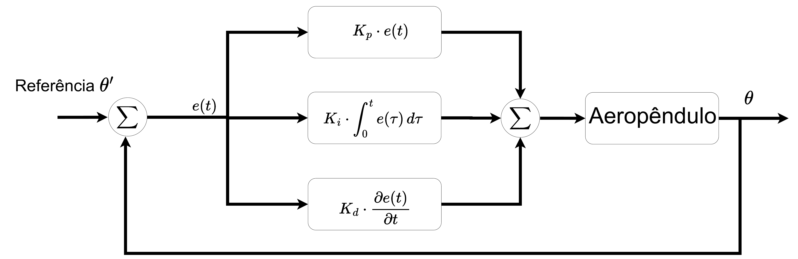

# Resultados em Malha Fechada

O diagrama acima resume a malha: a referência $\theta'$ é comparada com o ângulo medido
$\theta$, gerando o erro $e(t)$ que alimenta em paralelo os três termos do
[controlador PID](pid.md) ($K_p$, $K_i$ e $K_d$); a soma dos três é o sinal de controle
aplicado ao Aeropêndulo, cuja saída realimenta a malha.

## O que foi testado

Com o [modelo identificado](../identificacao/validacao.md) validado e o controlador PID
implementado no firmware, a interface gráfica foi usada para fechar a malha e aplicar dois
sinais de referência ao Aeropêndulo: uma onda quadrada (frequência de 0,5 Hz, amplitude de
15° e offset de 1V) e uma onda dente de serra. Em ambos os ensaios, o ângulo real do braço
-- medido pelo potenciômetro -- foi comparado com o sinal de referência, enquanto o gêmeo
digital consumia esse mesmo sinal angular em tempo real para exibir a dinâmica do sistema
graficamente.

## O que funcionou

Nos dois ensaios, a saída rastreia a referência: o ângulo medido acompanha tanto a onda
quadrada quanto a dente de serra, com o erro tendendo a zero graças ao termo integral do
controlador -- consistente com o que a teoria de controle prevê para um PID bem ajustado, e
com o requisito de projeto do controlador, que era justamente erro nulo em regime para uma
entrada do tipo degrau. Um detalhe honesto observado nos dois sinais: aparece um transitório
nas extremidades da forma de onda (visível como um aumento do sinal de erro nesses pontos),
análogo ao que se espera de uma resposta a um degrau.

## Limitações reconhecidas

A avaliação em malha fechada também foi qualitativa (inspeção visual dos gráficos), sem
métricas numéricas como tempo de acomodação, sobressinal ou erro em regime permanente
calculadas explicitamente. Isso, junto com a validação quantitativa do modelo (ver
[Validação do Modelo](../identificacao/validacao.md)), é a lacuna mais importante para
quem quiser transformar este trabalho em um artigo científico -- os dados brutos dos
ensaios já existem (`softwares_aeropendulo/src_interface/dados_de_ensaio/`), falta somente
processá-los.

## Trabalhos futuros sugeridos

O Cap. 4 da monografia aponta como próximos passos imediatos a documentação online (este
próprio site) e vídeos explicativos, mantendo o projeto como código aberto. Como
possibilidades de pesquisa a partir da plataforma já validada, o texto sugere explorar
outros métodos de identificação de sistemas, projetar controladores por abordagens
clássicas ou por inteligência artificial -- incluindo aprendizagem por reforço e deep
Q-learning -- e expandir o laboratório virtual com novas funcionalidades tanto na interface
gráfica quanto no protótipo físico.

---

**Ver também:** [← Controlador PID](pid.md)
{ .lv-see-also }
