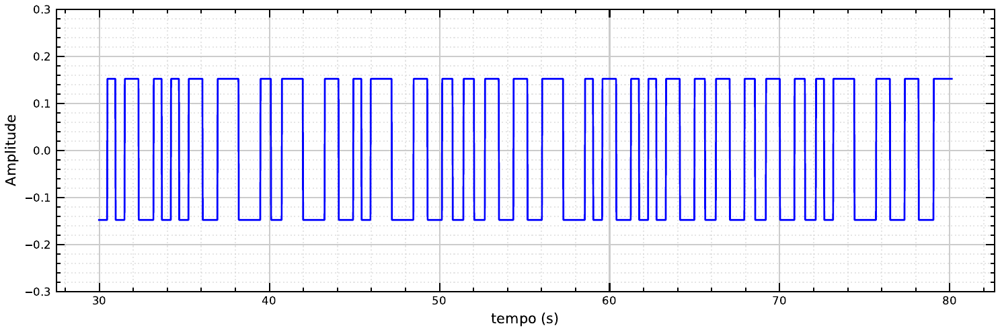
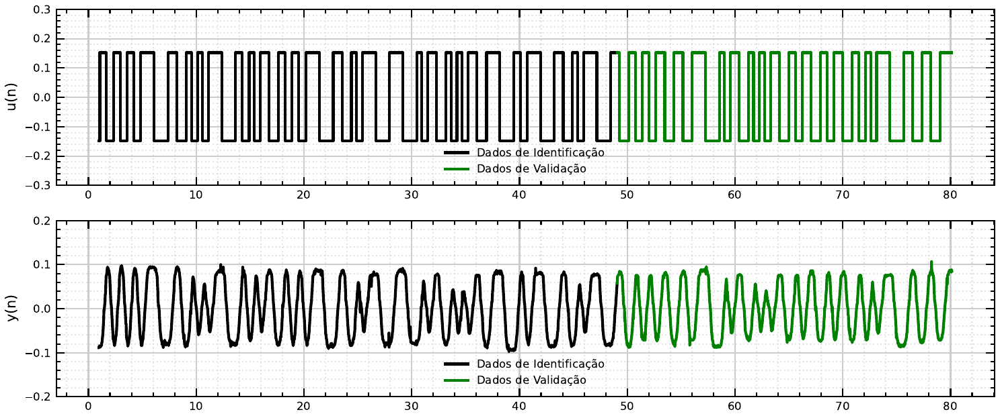

# Excitação e Aquisição

Identificação de sistemas obtém um modelo matemático a partir de **dados observados**, em
vez de deduzi-lo puramente da física (comparar com a [Modelagem Matemática](../modelagem/index.md)).
O primeiro passo é excitar o sistema real com um sinal conhecido e registrar como ele
responde.

## Por que PRBS

Um sinal PRBS (*Pseudo-Random Binary Sequence*) alterna entre dois níveis fixos seguindo uma
sequência que parece aleatória, mas é gerada de forma determinística. Essa alternância
irregular faz com que o sinal excite uma faixa ampla de frequências numa única coleta — ao
contrário de um degrau único (que concentra energia nas baixas frequências) ou de uma
senoide de frequência fixa (que só excita uma frequência por vez). Isso é o que permite
estimar, com um único ensaio, um modelo que descreva a dinâmica do sistema em várias
frequências de interesse.

No Aeropêndulo, o PRBS é gerado no firmware pela classe `OndaPrbs`, parametrizada por
frequência máxima, amplitude e offset, e aplicado à entrada do sistema em malha aberta:
frequência fundamental de 0,4 Hz, amplitude de 0,3 V e período de amostragem de 0,02 s. O
sinal é convertido em ciclo de trabalho PWM antes de ser enviado ao driver do motor (ver
[Firmware](../software/firmware.md)).

## Por que o offset

O PRBS não é aplicado em torno de zero, mas somado a um offset de 1 V — o ponto de operação
do Aeropêndulo. Em repouso, sem tensão nenhuma aplicada ao motor, o braço não sustenta a
haste no ar; ele cai para a posição vertical. O offset mantém o motor girando o suficiente
para que o sistema opere em torno de um ângulo de equilíbrio, e é em torno desse ponto que a
linearização usada na [Modelagem Matemática](../modelagem/index.md) é válida. Sem o offset, o
PRBS levaria o sistema para fora da região onde o modelo linear se aplica.

## Como os dados chegam ao computador

A cada ciclo de controle, o firmware envia pela porta serial o sinal de referência, o ângulo
medido, o erro, o sinal de controle e o sinal de excitação (PRBS, em malha aberta) — ver
[Firmware](../software/firmware.md) para os detalhes da biblioteca `ler_escrever_serial`. Do
lado do computador, a [Interface Gráfica](../software/interface-grafica.md) lê esses dados via
USB (PySerial), faz o pré-processamento e, ao final do ensaio, grava tudo em um arquivo CSV
usando Pandas.

## Formato dos dados coletados

Os arquivos CSV não têm cabeçalho — cada linha traz 7 colunas de dados, na ordem em que o
firmware as envia pela serial:

| Coluna | Conteúdo | Unidade | Origem no firmware |
| --- | --- | --- | --- |
| 0 | Sinal de referência (setpoint), **já somado a um offset fixo de +31** | graus | `*sinal_ref + 31` |
| 1 | Ângulo medido (saída do potenciômetro, convertido em `Conversor::converte_escala`) | graus | `*theta_saida` |
| 2 | Sinal de erro (`sinal_ref - (theta_saida - 31)` em malha fechada; `0` em malha aberta) | graus | `*erro` |
| 3 | Sinal de controle **antes** da conversão para ciclo PWM | Volts | `*sinal_controle` |
| 4 | Sinal de entrada em malha aberta (PRBS, `OndaPrbs::onda_prbs()`); `0` em malha fechada | Volts | `*sinal_entrada_ma` (o parâmetro da função chama-se `ampl`, mas quem chama passa `sinal_entrada_ma` — nome interno enganoso) |
| 5 | **Repetição exata da coluna 4** — o firmware imprime a mesma variável duas vezes; comentário no código diz "estruturas reservas de envio de dados" (reservado para uso futuro, não usado hoje) | Volts | `*ampl` (mesmo valor da coluna 4) |
| 6 | Tempo decorrido do ensaio, incrementos de `Ts = 0,02` s | segundos | `*t` |

Os arquivos de cada ensaio ficam em `softwares_aeropendulo/src_interface/dados_de_ensaio/`.

## Separação treino/teste

A monografia descreve a divisão dos dados do ensaio em dois conjuntos: 60% para
identificação (usados para ajustar os coeficientes do modelo) e 40% para validação. Na
prática, a validação usada neste laboratório roda o modelo sobre o mesmo sinal de entrada do
ensaio de identificação e compara a saída simulada com a saída real medida — ver
[Validação do Modelo](validacao.md).

---

**Ver também:** [← Modelagem Matemática](../modelagem/index.md) ·
[Estimação por Mínimos Quadrados →](estimacao.md)
