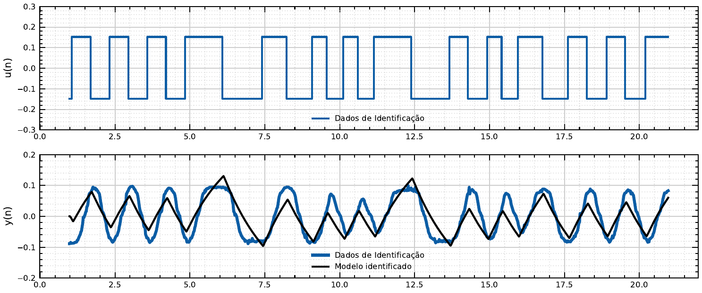

# Validação do Modelo

Depois de estimar os coeficientes (ver [Estimação por Mínimos Quadrados](estimacao.md)), é
preciso confirmar que o modelo reproduz a dinâmica real. O teste usado aqui é a validação
por simulação livre: a mesma entrada $u(n)$ usada no ensaio de identificação é aplicada à
função de transferência discreta obtida, gerando uma saída simulada que é então sobreposta
à saída real $y(n)$ medida no sistema.

## Modelo de 2ª ordem: insuficiente

O gráfico superior mostra a entrada PRBS aplicada; o inferior compara a saída real (azul,
mais grossa) com a saída simulada pelo modelo de 2ª ordem (preta). O modelo acompanha o
período das oscilações, mas não a sua forma: onde a saída real tem picos mais arredondados
e, em vários trechos, um duplo lóbulo por ciclo, a saída simulada produz picos mais agudos e
de amplitude maior — por exemplo, perto de $t \approx 6\,$s e $t \approx 12,5\,$s, o modelo
chega a quase 0,13 enquanto a saída real fica em torno de 0,09-0,10. Essa divergência de
forma e amplitude, repetida ao longo de todo o ensaio, foi a evidência visual que motivou
subir a ordem do modelo.

## Modelo de 10ª ordem: aceitável

Com a estrutura de 10ª ordem, a saída simulada acompanha de forma bem mais próxima a saída
real ao longo de todo o intervalo mostrado: os picos e vales coincidem em amplitude e em
instante de tempo, inclusive nos trechos em que o modelo de 2ª ordem havia divergido mais.
O modelo identificado ainda não reproduz a pequena ondulação de alta frequência presente na
saída real (visível como um leve serrilhado sobre a curva azul), mas captura bem a dinâmica
dominante do sistema, o que foi considerado suficiente para seguir adiante com o projeto do
controlador.

## Limitação reconhecida

Esta validação é **qualitativa** (comparação visual dos gráficos), sem uma métrica
numérica de erro (RMSE/EQM) calculada no trabalho original. Isso é uma limitação conhecida
-- ver [pendências de documentação](https://github.com/Oseiasdfarias/lab-virtual/blob/main/docs_tcc/05_plano_publicacoes/pendencias_documentacao.md)
no repositório para o item em aberto sobre validação quantitativa.
