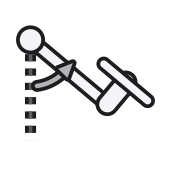

---
hide:
    - toc
---

  

<h1 align="center">Laboratório Virtual</h1>

<i>Protótipo, gêmeo digital e identificação de sistemas aplicados a um
aeropêndulo — um mapa completo do desenvolvimento, da física ao código.</i>

## Comece por aqui

- **Quer uma visão rápida?** → [O que é o Laboratório Virtual](visao-geral/index.md)
- **Quer aprender o processo científico?** → [Modelagem Matemática](modelagem/index.md) →
  [Identificação de Sistemas](identificacao/excitacao.md) →
  [Projeto de Controle](controle/pid.md)
- **Quer reproduzir ou modificar o hardware/software?** →
  [Protótipo](prototipo/index.md) e [Software](software/interface-grafica.md)

## Sobre o projeto

Esse projeto surgiu do desenvolvimento de um <strong>trabalho de conclusão de curso</strong>, intitulado, <strong>Desenvolvimento de Protótipo e Gêmeo Digital como Ferramenta para um Laboratório Virtual com Foco em Modelagem e Controle de Sistemas Dinâmicos</strong>, desennvolvido na <strong>Universidade Federal do Pará</strong> no <strong>Campus de Tucuruí</strong>, pelo discente da <strong>Faculdade de Engenharia Elétrica</strong>, <strong>Oséias Farias</strong>. 

<h3 align=center><strong>Membros Atuais</strong> ✨</h3>

<table align="center">
      <tbody>
        <tr>
          <td align="center"><a href="https://github.com/raphateixeira"  target="_blank"> <b>Raphael Teixeira</b></a> <a href="https://github.com/raphateixeira/LabVirtual/commits?author=raphateixeira"  target="_blank" title="Code">⚡</a></td>
          <td align="center"><a href="https://github.com/Oseiasdfarias"  target="_blank"> <b>Oséias Farias</b></a> <a href="https://github.com/raphateixeira/LabVirtual/commits?author=Oseiasdfarias"  target="_blank" title="Code">⚡</a></td>
        </tr>
      </tbody>
    </table>

## Demonstração

<iframe src="https://player.vimeo.com/video/893039111?h=80089a63c1&autoplay=1&loop=1" style="position:absolute;top:0;left:0;width:90%;height:90%;" frameborder="0" allow="autoplay; fullscreen; picture-in-picture" allowfullscreen></iframe>

