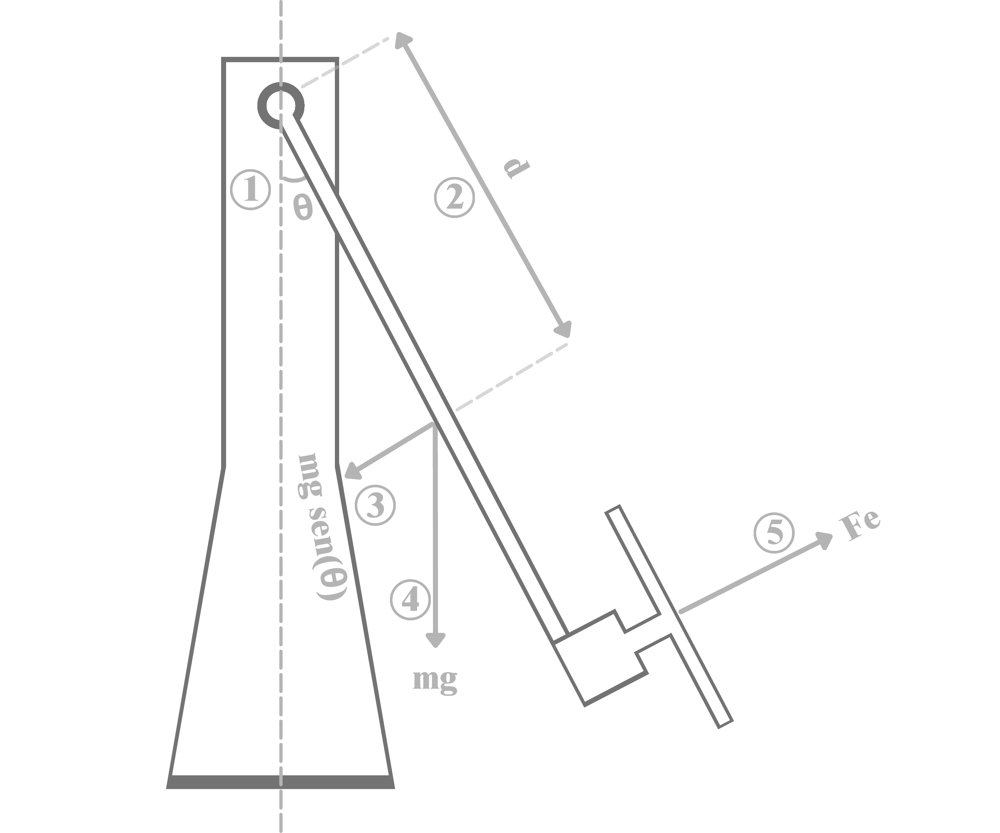
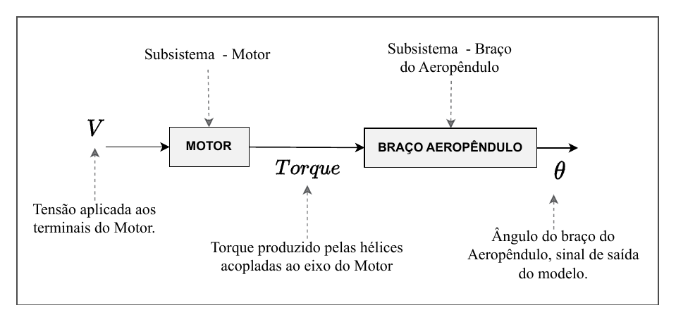
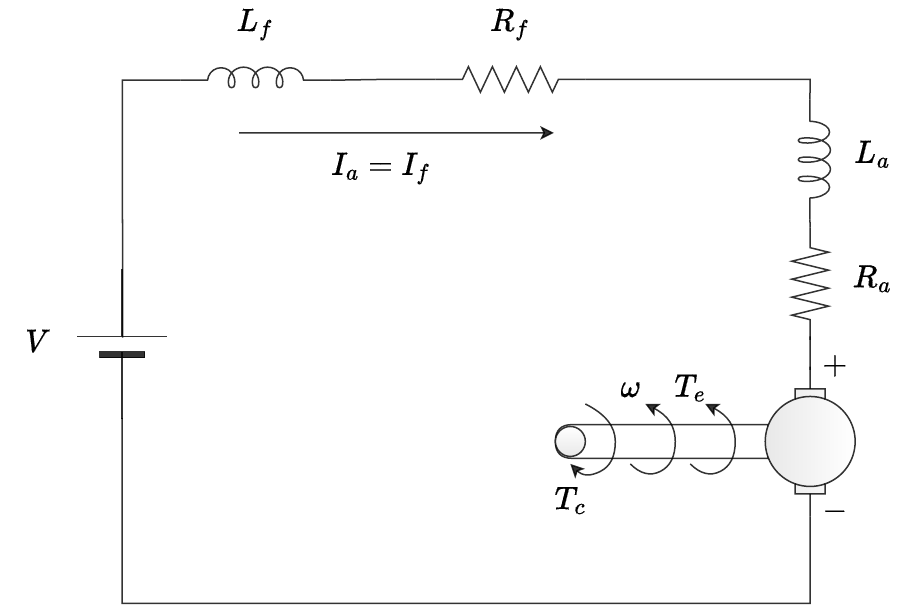

# Modelagem Matemática

O Aeropêndulo tem um único grau de liberdade: o ângulo $\theta$ do braço em relação à
vertical. A entrada do sistema é a tensão $V$ aplicada aos terminais do motor CC que aciona
a hélice, e a saída é esse ângulo $\theta$. Modelar o sistema significa encontrar a equação
diferencial que relaciona essas duas grandezas a partir das leis da física — e é essa
dedução, ponto a ponto, que esta página documenta.

## Como a física vira equação

O braço do Aeropêndulo é, mecanicamente, um pêndulo acionado por um empuxo em vez de por um
peso na ponta. A hélice, girada pelo motor, produz um empuxo que gera um torque em torno do
pivô do braço; esse torque tem que vencer três coisas ao mesmo tempo: a inércia do próprio
braço (ele resiste a acelerar), o atrito viscoso do pivô (que se opõe à velocidade angular)
e a gravidade, que puxa o braço de volta para a posição de repouso na vertical. Escrevendo
esse balanço de torques com a segunda lei de Newton para rotação, chega-se ao modelo
não linear do sistema:

<figure class="lv-aeropendulo-figure" markdown="span">
  

<svg viewBox="20 0 190 200" width="480" xmlns="http://www.w3.org/2000/svg">
  <!-- Envelope dinâmico de oscilação angular -->
  <path d="M 110.4 100.7 A 60.6 60.6 0 0 0 163.6 100.7" fill="none" stroke="#D0D0D4" stroke-width="0.5" stroke-dasharray="2.5,2.5" />
  <line x1="137" y1="46.2" x2="110.4" y2="100.7" stroke="#E0E0E4" stroke-width="0.4" stroke-dasharray="1.5,2.5" />
  <line x1="137" y1="46.2" x2="163.6" y2="100.7" stroke="#E0E0E4" stroke-width="0.4" stroke-dasharray="1.5,2.5" />

  <!-- 1. BASE HEXAGONAL -->
  <polygon points="58,154 78,142 144,142 166,154 144,166 78,166" fill="#F0F0F2" stroke="#1D1D1F" stroke-width="1.0" stroke-linejoin="round" />
  <polygon points="58,154 78,166 78,170 58,158" fill="#D8D8DA" stroke="#1D1D1F" stroke-width="1.0" stroke-linejoin="round" />
  <polygon points="78,166 144,166 144,170 78,170" fill="#E3E3E5" stroke="#1D1D1F" stroke-width="1.0" stroke-linejoin="round" />
  <polygon points="144,166 166,154 166,158 144,170" fill="#C9C9CB" stroke="#1D1D1F" stroke-width="1.0" stroke-linejoin="round" />
  <line x1="38" y1="154" x2="186" y2="154" stroke="#BBBBBC" stroke-width="0.5" stroke-dasharray="3,2" />
  <line x1="58" y1="154" x2="166" y2="154" stroke="#BBBBBC" stroke-width="0.6" stroke-dasharray="3,2" />
  <line x1="110" y1="138" x2="110" y2="178" stroke="#D0D0D4" stroke-width="0.4" stroke-dasharray="2,2" />
  <circle cx="110" cy="154" r="1.5" fill="#1D1D1F" />

  <!-- 2. REFORÇO TRIANGULAR + MASTRO -->
  <polygon points="68,154 98,154 98,82" fill="#E3E3E5" stroke="#1D1D1F" stroke-width="1.1" />
  <line x1="78" y1="154" x2="98" y2="116" stroke="#C9C9CB" stroke-width="0.7"/>
  <line x1="88" y1="154" x2="98" y2="136" stroke="#C9C9CB" stroke-width="0.7"/>
  <line x1="68" y1="154" x2="108" y2="58" stroke="#D0D0D4" stroke-width="0.4" stroke-dasharray="2,3" />
  <rect x="98" y="44" width="7" height="110" fill="#E3E3E5" stroke="#1D1D1F" stroke-width="1.1" />
  <line x1="101.5" y1="28" x2="101.5" y2="175" stroke="#C0C0C4" stroke-width="0.4" stroke-dasharray="3,3" />

  <!-- 3. TRAVESSA HORIZONTAL -->
  <line x1="85" y1="46.2" x2="155" y2="46.2" stroke="#BBBBBC" stroke-width="0.5" stroke-dasharray="3,2" />
  <rect x="96" y="43" width="45" height="6.5" rx="1.5" fill="#1D1D1F" stroke="#1D1D1F" stroke-width="1.0" />
  <circle cx="101.5" cy="46.2" r="1.2" fill="#F5F5F7" />
  <circle cx="137.5" cy="46.2" r="1.2" fill="#F5F5F7" />

  <!-- 4. HASTE FIBRA DE CARBONO -->
  <rect x="136.1" y="6" width="1.8" height="96" rx="0.4" fill="#1D1D1F" />

  <!-- 5. EIXO DE ROTAÇÃO / MANCAL -->
  <circle cx="137" cy="46.2" r="4.2" fill="#C9C9CB" stroke="#1D1D1F" stroke-width="1.1" />
  <circle cx="137" cy="46.2" r="2.0" fill="#1D1D1F" />
  <circle cx="137" cy="46.2" r="0.8" fill="#F5F5F7" />
  <line x1="137" y1="51" x2="137" y2="135" stroke="#8A8A8C" stroke-width="0.5" stroke-dasharray="3,3" />

  <!-- 6. MOTOR + HÉLICE -->
  <rect x="133" y="99" width="8" height="7" rx="1.5" fill="#1D1D1F" stroke="#1D1D1F" stroke-width="0.8" />
  <circle cx="137" cy="102.5" r="1.5" fill="#F5F5F7" />
  <path d="M 134 106 C 127 102.0, 116 100.5, 109 103.0 C 107.5 104.5, 108 106.5, 111 107.5 C 120 110.5, 129 109.0, 134 107.5 Z" fill="#1D1D1F" stroke="#1D1D1F" stroke-width="0.8" stroke-linejoin="round" />
  <path d="M 140 107.5 C 145 109.0, 154 110.5, 163 107.5 C 166 106.5, 166.5 104.5, 165 103.0 C 158 100.5, 147 102.0, 140 106.0 Z" fill="#1D1D1F" stroke="#1D1D1F" stroke-width="0.8" stroke-linejoin="round" />
  <path d="M 110.5 104 C 117 102.5, 126 104, 133.5 106.5" fill="none" stroke="#E3E3E5" stroke-width="1.0" stroke-linecap="round" />
  <path d="M 140.5 106.5 C 148 104, 157 102.5, 163.5 104" fill="none" stroke="#E3E3E5" stroke-width="1.0" stroke-linecap="round" />
  <circle cx="137" cy="106.8" r="28" fill="none" stroke="#BBBBBC" stroke-width="0.6" stroke-dasharray="2,3" />
  <line x1="95" y1="106.8" x2="179" y2="106.8" stroke="#D0D0D4" stroke-width="0.4" stroke-dasharray="3,2" />
  <line x1="137" y1="85" x2="137" y2="103" stroke="#BBBBBC" stroke-width="0.5" stroke-dasharray="2,2" />
  <circle cx="137" cy="106.8" r="3.6" fill="#1D1D1F" />
  <circle cx="137" cy="106.8" r="1.8" fill="#F5F5F7" />
  <circle cx="137" cy="106.8" r="0.8" fill="#1D1D1F" />

  <!-- ANOTAÇÕES DE FÍSICA -->
  <!-- θ — ângulo da haste no pivô -->
  <line x1="137" y1="46.2" x2="148" y2="38" stroke="#8A8A8C" stroke-width="0.7" />
  <text x="150" y="37" font-size="7.5" font-weight="700" fill="#1D1D1F" font-family="serif" text-anchor="start">θ</text>

  <!-- τ_emp — torque de empuxo (seta para cima, saindo do motor) -->
  <line x1="137" y1="98" x2="137" y2="80" stroke="#1D1D1F" stroke-width="1.0" marker-end="url(#arr)" />
  <defs>
    <marker id="arr" markerWidth="5" markerHeight="5" refX="2.5" refY="2.5" orient="auto">
      <polygon points="0 0, 5 2.5, 0 5" fill="#1D1D1F" />
    </marker>
  </defs>
  <text x="140" y="78" font-size="6.5" font-weight="600" fill="#1D1D1F" font-family="IBM Plex Mono" text-anchor="start">τ_emp</text>

  <!-- τ_grav — torque gravitacional (seta para baixo, a partir do centro da haste) -->
  <line x1="137" y1="68" x2="137" y2="86" stroke="#8A8A8C" stroke-width="1.0" marker-end="url(#arr2)" />
  <defs>
    <marker id="arr2" markerWidth="5" markerHeight="5" refX="2.5" refY="2.5" orient="auto">
      <polygon points="0 0, 5 2.5, 0 5" fill="#8A8A8C" />
    </marker>
  </defs>
  <text x="119" y="66" font-size="6.5" font-weight="600" fill="#8A8A8C" font-family="IBM Plex Mono" text-anchor="end">τ_grav</text>

  <!-- c·θ̇ — amortecimento no pivô -->
  <text x="150" y="50" font-size="6.5" font-weight="600" fill="#8A8A8C" font-family="IBM Plex Mono" text-anchor="start">c·θ̇</text>
</svg>
  

  <figcaption>Figura — Diagrama de corpo livre do aeropêndulo: θ é o ângulo da haste, τ_emp o torque de empuxo, τ_grav o torque gravitacional restaurador e c·θ̇ o amortecimento viscoso no pivô.</figcaption>
</figure>

$$
K_m V = J\ddot\theta + c\dot\theta + mgd\sin(\theta)
$$

O lado esquerdo, $K_m V$, é o torque de entrada: a relação entre a tensão do motor $V$ e o
empuxo da hélice é, na realidade, não linear, mas para a faixa de operação do protótipo ela
é bem aproximada por um ganho constante $K_m$. O lado direito é o torque resistivo, formado
por três parcelas — $J\ddot\theta$ é o torque inercial (proporcional à aceleração angular),
$c\dot\theta$ é o torque de amortecimento viscoso (proporcional à velocidade angular) e
$mgd\sin(\theta)$ é o torque gravitacional restaurador, que tenta trazer o braço de volta
para $\theta = 0$.

Essa equação descreve apenas o braço, mas o sistema físico completo — motor mais braço —
pode ser pensado como dois subsistemas em série: o motor CC transforma a tensão $V$ em
torque, e o braço transforma esse torque em ângulo $\theta$. A figura abaixo mostra essa
divisão.

### O subsistema motor

O motor do protótipo é um motor CC **série**: o enrolamento de campo está ligado em série com
o de armadura, então a mesma corrente $i = i_a = i_f$ passa pelos dois. O diagrama abaixo
mostra as resistências e indutâncias de campo ($R_f$, $L_f$) e de armadura ($R_a$, $L_a$), a
velocidade angular $\omega$ do eixo, o torque eletromagnético $T_e$ e o torque de carga $T_c$.

Pela lei das tensões de Kirchhoff, com $R = R_a + R_f$ e $L = L_a + L_f$, e pelo balanço de
torques no eixo, com momento de inércia $J_m$ e amortecimento viscoso $b$:

$$
V = Ri + L\frac{di}{dt} + E_a \qquad\qquad J_m\dot\omega = T_e - b\omega - T_c
$$

Tanto a força contraeletromotriz $E_a$ quanto o torque $T_e$ dependem do fluxo magnético,
que no motor série é produzido pela própria corrente. Desprezando a saturação, o fluxo é
aproximado por $K_0 i$, o que dá $E_a = K_0\omega i$ e

$$
T_e = K_0 i^2
$$

O torque cresce com o **quadrado** da corrente, então o motor é, por si só, um subsistema
não linear. O modelo do braço usado nesta página contorna isso resumindo o motor a um ganho
constante $K_m$ entre tensão e torque. A monografia também aponta que parâmetros como $J_m$,
e o amortecimento $c$ do pivô do braço, são difíceis de obter numericamente — e usa essa
dificuldade como motivação para a [identificação de sistemas](../identificacao/excitacao.md),
que chega a um modelo a partir dos dados de ensaio.

!!! note "Duas formulações de $K_m$"
    Esta página segue o notebook
    `Modelagem_matematica_do_aeropendulo.ipynb`, em que $K_m$ liga diretamente a tensão do
    motor ao torque de entrada do braço ($K_mV$). Na monografia, o braço recebe o empuxo
    $F_e$ da hélice, e $K_m$ liga a velocidade angular do motor a esse empuxo pela
    aproximação linear $F_e = K_m\omega$ da relação $F_e = K_m\omega^2$; a função de
    transferência do braço fica então $\theta(s)/\omega(s)$, encadeada à saída do modelo do
    motor. Os valores numéricos da tabela abaixo são os do notebook.

## Linearização

A equação não linear acima é fiel à física do sistema, mas a maior parte das técnicas
clássicas de projeto de controle — PID, alocação de polos, resposta em frequência — foi
desenvolvida para sistemas lineares, descritos por funções de transferência. Para usar
essas ferramentas é preciso obter uma versão linear do modelo, válida ao menos numa
vizinhança do ponto de operação.

A não linearidade do modelo do Aeropêndulo está inteiramente concentrada no termo
$\sin(\theta)$. Para pequenas variações do ângulo em torno de $\theta = 0$, vale a
aproximação $\sin(\theta) \approx \theta$ — é a mesma aproximação usada, por exemplo, na
modelagem do pêndulo simples. Substituindo essa aproximação na equação não linear, obtém-se
o modelo linearizado:

$$
K_m V = J\ddot\theta + c\dot\theta + mgd\theta
$$

Essa é a equação usada daqui em diante: uma equação diferencial linear de segunda ordem,
relacionando a tensão de entrada $V$ ao ângulo de saída $\theta$.

## Da equação diferencial à função de transferência

Uma equação diferencial descreve a dinâmica no domínio do tempo, mas o projeto de
controladores clássicos é feito no domínio da frequência, usando funções de transferência.
A ponte entre os dois domínios é a transformada de Laplace: aplicando-a à equação
linearizada (com condições iniciais nulas) e isolando a razão entre a saída $\theta(s)$ e a
entrada $V(s)$, chega-se à função de transferência do sistema:

$$
\frac{\theta(s)}{V(s)} = \frac{K_m/J}{s^2 + (c/J)s + mgd/J}
$$

Essa é a forma simbólica, válida para qualquer Aeropêndulo com essa mesma estrutura física.
Substituindo os valores numéricos dos parâmetros do protótipo (tabela abaixo), obtém-se a
função de transferência numérica usada nas simulações e no projeto do controlador:

$$
\frac{\theta(s)}{V(s)} = \frac{2{,}792}{s^2 + 0{,}717\,s + 9{,}985}
$$

## Parâmetros físicos

Os valores usados para obter a função de transferência numérica são os parâmetros físicos
do protótipo, medidos ou estimados a partir da geometria e da massa do braço:

| Parâmetro | Valor | Unidade |
| --- | --- | --- |
| $K_m$ | 0,0296 | N·m/V |
| $d$ | 0,03 | m |
| $J$ | 0,0106 | kg·m² |
| $m$ | 0,36 | kg |
| $g$ | 9,8 | m/s² |
| $c$ | 0,0076 | N·m·s/rad |

## Representação em espaço de estados

Além da função de transferência, o mesmo modelo linearizado pode ser escrito em espaço de
estados, definindo os estados $x_1 = \theta$ (posição angular) e $x_2 = \dot\theta$
(velocidade angular):

$$
\begin{bmatrix}\dot x_1\\ \dot x_2\end{bmatrix} =
\begin{bmatrix}0 & 1\\ -mgd/J & -c/J\end{bmatrix}
\begin{bmatrix}x_1\\ x_2\end{bmatrix} +
\begin{bmatrix}0\\ K_m/J\end{bmatrix} u
$$

em que $u = V$ é a entrada de tensão do motor. Essa representação carrega exatamente a
mesma informação da função de transferência, mas em outra forma matemática — e é essa outra
forma que torna o modelo mais útil em duas frentes que aparecem mais adiante no laboratório:
a simulação numérica do sistema, feita integrando essas equações diretamente com bibliotecas
como `scipy` ou `python-control`, e o projeto de controladores modernos (como os baseados em
alocação de polos ou realimentação de estados), que trabalham diretamente sobre as matrizes
$A$ e $B$ em vez da função de transferência.

## Onde essa dedução aparece no código

O modelo linearizado acima é implementado e simulado em
[`Modelagem_matematica_do_aeropendulo.ipynb`](https://github.com/Oseiasdfarias/lab-virtual/blob/main/softwares_aeropendulo/simulador_aeropendulo/docs/Modelagem_matematica_do_aeropendulo.ipynb),
usando as bibliotecas NumPy e Python-Control. A [identificação de sistemas](../identificacao/excitacao.md)
usa uma abordagem diferente — ajustar o modelo a dados reais em vez de derivá-lo
puramente da física — e chega a um modelo mais preciso, validado comparando a saída
simulada com a saída real do protótipo.
