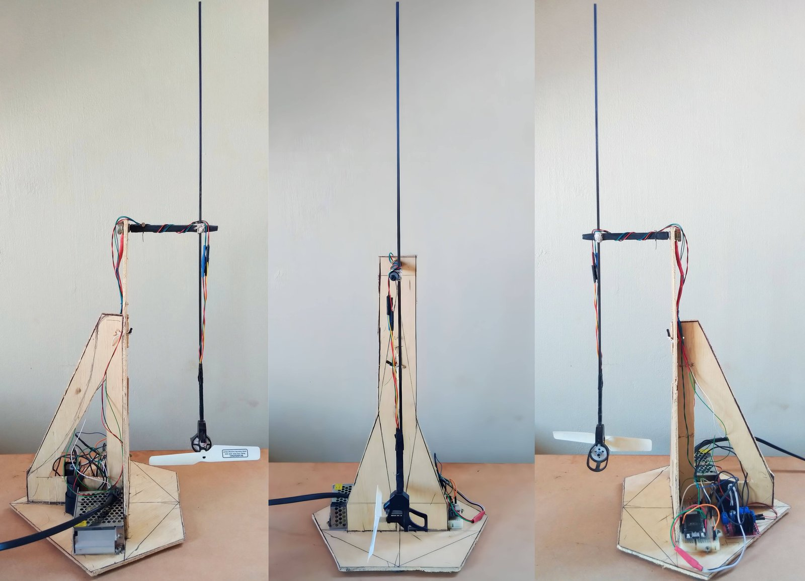
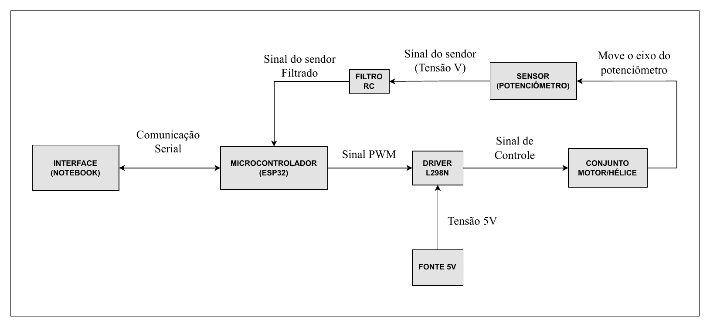
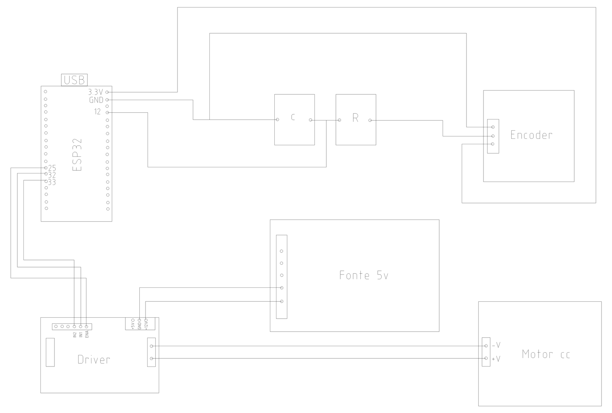

<figure markdown="span">
  
  <figcaption>Figura 1 — Protótipo do Aeropêndulo.</figcaption>
</figure>

## Lista de materiais

| Item | Especificação | Função |
| --- | --- | --- |
| Estrutura | Chapas de compensado | Base e colunas desmontáveis |
| Braço | Tubo de fibra de carbono 3×3×2 mm | Haste leve entre o pivô e o motor |
| Sensor de ângulo | Potenciômetro de 50 kΩ | Mede o ângulo do braço no pivô |
| Microcontrolador | Placa de desenvolvimento ESP32 (TTGO T1) | Leitura do sensor, controle e comunicação serial |
| Driver de potência | Módulo driver L298N (ponte H) | Aplica ao motor a tensão comandada pelo PWM |
| Conjunto de propulsão | Suporte, motor e hélice para drones FPV racing | Gera o empuxo na ponta do braço |
| Alimentação | Fonte chaveada de 5 V, 25 W | Alimenta o driver e o motor |
| Filtro do sensor | Resistor e capacitor (filtro RC série) | Reduz o ruído do sinal do potenciômetro |

<figure class="lv-aeropendulo-figure" markdown="span">
  

<svg viewBox="20 0 190 200" width="480" xmlns="http://www.w3.org/2000/svg">
  <!-- Envelope dinâmico de oscilação angular -->
  <path d="M 110.4 100.7 A 60.6 60.6 0 0 0 163.6 100.7" fill="none" stroke="#D0D0D4" stroke-width="0.5" stroke-dasharray="2.5,2.5" />
  <line x1="137" y1="46.2" x2="110.4" y2="100.7" stroke="#E0E0E4" stroke-width="0.4" stroke-dasharray="1.5,2.5" />
  <line x1="137" y1="46.2" x2="163.6" y2="100.7" stroke="#E0E0E4" stroke-width="0.4" stroke-dasharray="1.5,2.5" />

  <!-- 1. BASE HEXAGONAL -->
  <polygon points="58,154 78,142 144,142 166,154 144,166 78,166" fill="#F0F0F2" stroke="#1D1D1F" stroke-width="1.0" stroke-linejoin="round" />
  <polygon points="58,154 78,166 78,170 58,158" fill="#D8D8DA" stroke="#1D1D1F" stroke-width="1.0" stroke-linejoin="round" />
  <polygon points="78,166 144,166 144,170 78,170" fill="#E3E3E5" stroke="#1D1D1F" stroke-width="1.0" stroke-linejoin="round" />
  <polygon points="144,166 166,154 166,158 144,170" fill="#C9C9CB" stroke="#1D1D1F" stroke-width="1.0" stroke-linejoin="round" />
  <line x1="38" y1="154" x2="186" y2="154" stroke="#BBBBBC" stroke-width="0.5" stroke-dasharray="3,2" />
  <line x1="58" y1="154" x2="166" y2="154" stroke="#BBBBBC" stroke-width="0.6" stroke-dasharray="3,2" />
  <line x1="110" y1="138" x2="110" y2="178" stroke="#D0D0D4" stroke-width="0.4" stroke-dasharray="2,2" />
  <circle cx="110" cy="154" r="1.5" fill="#1D1D1F" />
  <!-- Cota D -->
  <line x1="58" y1="180" x2="166" y2="180" stroke="#8A8A8C" stroke-width="0.5" />
  <line x1="58" y1="172" x2="58" y2="183" stroke="#8A8A8C" stroke-width="0.5" />
  <line x1="166" y1="156" x2="166" y2="183" stroke="#8A8A8C" stroke-width="0.5" />
  <rect x="101" y="181.5" width="22" height="7" fill="#F7F7F9" />
  <text x="112" y="187" font-size="6" font-weight="600" fill="#1D1D1F" font-family="IBM Plex Mono" text-anchor="middle">D=220</text>

  <!-- 2. REFORÇO TRIANGULAR + MASTRO -->
  <polygon points="68,154 98,154 98,82" fill="#E3E3E5" stroke="#1D1D1F" stroke-width="1.1" />
  <line x1="78" y1="154" x2="98" y2="116" stroke="#C9C9CB" stroke-width="0.7"/>
  <line x1="88" y1="154" x2="98" y2="136" stroke="#C9C9CB" stroke-width="0.7"/>
  <line x1="68" y1="154" x2="108" y2="58" stroke="#D0D0D4" stroke-width="0.4" stroke-dasharray="2,3" />
  <rect x="98" y="44" width="7" height="110" fill="#E3E3E5" stroke="#1D1D1F" stroke-width="1.1" />
  <line x1="101.5" y1="28" x2="101.5" y2="175" stroke="#C0C0C4" stroke-width="0.4" stroke-dasharray="3,3" />
  <!-- Cota H -->
  <line x1="48" y1="44" x2="48" y2="154" stroke="#8A8A8C" stroke-width="0.5" />
  <line x1="45" y1="44" x2="96" y2="44" stroke="#8A8A8C" stroke-width="0.5" stroke-dasharray="1.5,1.5" />
  <line x1="45" y1="154" x2="58" y2="154" stroke="#8A8A8C" stroke-width="0.5" />
  <rect x="31" y="95" width="16" height="7" fill="#F7F7F9" />
  <text x="39" y="101" font-size="6" font-weight="600" fill="#1D1D1F" font-family="IBM Plex Mono" text-anchor="middle">H=300</text>

  <!-- 3. TRAVESSA HORIZONTAL -->
  <line x1="85" y1="46.2" x2="155" y2="46.2" stroke="#BBBBBC" stroke-width="0.5" stroke-dasharray="3,2" />
  <rect x="96" y="43" width="45" height="6.5" rx="1.5" fill="#1D1D1F" stroke="#1D1D1F" stroke-width="1.0" />
  <circle cx="101.5" cy="46.2" r="1.2" fill="#F5F5F7" />
  <circle cx="137.5" cy="46.2" r="1.2" fill="#F5F5F7" />
  <!-- Cota W -->
  <line x1="96" y1="36" x2="141" y2="36" stroke="#8A8A8C" stroke-width="0.5" />
  <line x1="96" y1="33" x2="96" y2="43" stroke="#8A8A8C" stroke-width="0.5" />
  <line x1="141" y1="33" x2="141" y2="43" stroke="#8A8A8C" stroke-width="0.5" />
  <rect x="109" y="32.5" width="19" height="7" fill="#F7F7F9" />
  <text x="118.5" y="38" font-size="6" font-weight="600" fill="#1D1D1F" font-family="IBM Plex Mono" text-anchor="middle">W=45</text>

  <!-- 4. HASTE FIBRA DE CARBONO -->
  <rect x="136.1" y="6" width="1.8" height="96" rx="0.4" fill="#1D1D1F" />
  <!-- Cota L -->
  <line x1="172" y1="6" x2="172" y2="102" stroke="#8A8A8C" stroke-width="0.5" />
  <line x1="169" y1="6" x2="175" y2="6" stroke="#8A8A8C" stroke-width="0.5" />
  <line x1="169" y1="102" x2="175" y2="102" stroke="#8A8A8C" stroke-width="0.5" />
  <line x1="170" y1="46.2" x2="174" y2="46.2" stroke="#8A8A8C" stroke-width="0.5" stroke-dasharray="1.5,1.5" />
  <rect x="172" y="50" width="19" height="7" fill="#F7F7F9" />
  <text x="181.5" y="56" font-size="6" font-weight="600" fill="#1D1D1F" font-family="IBM Plex Mono" text-anchor="middle">L=96</text>

  <!-- 5. EIXO DE ROTAÇÃO / MANCAL -->
  <circle cx="137" cy="46.2" r="4.2" fill="#C9C9CB" stroke="#1D1D1F" stroke-width="1.1" />
  <circle cx="137" cy="46.2" r="2.0" fill="#1D1D1F" />
  <circle cx="137" cy="46.2" r="0.8" fill="#F5F5F7" />
  <line x1="137" y1="51" x2="137" y2="135" stroke="#8A8A8C" stroke-width="0.5" stroke-dasharray="3,3" />

  <!-- 6. MOTOR + HÉLICE -->
  <rect x="133" y="99" width="8" height="7" rx="1.5" fill="#1D1D1F" stroke="#1D1D1F" stroke-width="0.8" />
  <circle cx="137" cy="102.5" r="1.5" fill="#F5F5F7" />
  <path d="M 134 106 C 127 102.0, 116 100.5, 109 103.0 C 107.5 104.5, 108 106.5, 111 107.5 C 120 110.5, 129 109.0, 134 107.5 Z" fill="#1D1D1F" stroke="#1D1D1F" stroke-width="0.8" stroke-linejoin="round" />
  <path d="M 140 107.5 C 145 109.0, 154 110.5, 163 107.5 C 166 106.5, 166.5 104.5, 165 103.0 C 158 100.5, 147 102.0, 140 106.0 Z" fill="#1D1D1F" stroke="#1D1D1F" stroke-width="0.8" stroke-linejoin="round" />
  <path d="M 110.5 104 C 117 102.5, 126 104, 133.5 106.5" fill="none" stroke="#E3E3E5" stroke-width="1.0" stroke-linecap="round" />
  <path d="M 140.5 106.5 C 148 104, 157 102.5, 163.5 104" fill="none" stroke="#E3E3E5" stroke-width="1.0" stroke-linecap="round" />
  <circle cx="137" cy="106.8" r="28" fill="none" stroke="#BBBBBC" stroke-width="0.6" stroke-dasharray="2,3" />
  <line x1="95" y1="106.8" x2="179" y2="106.8" stroke="#D0D0D4" stroke-width="0.4" stroke-dasharray="3,2" />
  <line x1="137" y1="85" x2="137" y2="103" stroke="#BBBBBC" stroke-width="0.5" stroke-dasharray="2,2" />
  <circle cx="137" cy="106.8" r="3.6" fill="#1D1D1F" />
  <circle cx="137" cy="106.8" r="1.8" fill="#F5F5F7" />
  <circle cx="137" cy="106.8" r="0.8" fill="#1D1D1F" />
</svg>
  

  <figcaption>Figura — Perfil técnico do protótipo com as dimensões reais: base hexagonal de compensado naval 15 mm de espessura (D = 220 mm), mastro vertical de compensado (H = 300 mm), travessa horizontal de alumínio (W = 45 mm), haste de fibra de carbono 3×3×2 mm (L = 96 mm por lado do eixo de rotação no pivô).</figcaption>
</figure>

A monografia não informa os valores do resistor e do capacitor do filtro RC. Sobre a fonte, o
título da figura fala em 2 A e o texto em 5 A; os 25 W correspondem a 5 V × 5 A.

## Parte estrutural

O material escolhido para a estrutura foi o compensado — chapas fabricadas a partir de
finas lâminas de madeira coladas com fibras perpendiculares, o que confere maior
estabilidade e resistência mecânica ao produto final.

Já para o braço do Aeropêndulo foi usado um tubo de fibra de carbono de 3×3×2 mm, material
que se destaca pela leveza e resistência física. Na extremidade do braço fica o conjunto
motor/hélice responsável por impulsionar a dinâmica do sistema — por isso é essencial
minimizar a massa do braço: quanto menor a massa, menores as forças de resistência que o
empuxo precisa vencer, resultando numa dinâmica mais ágil e eficiente.

## Parte elétrica

Componentes eletrônicos empregados no projeto: um potenciômetro de 50 kΩ, uma placa de
desenvolvimento ESP32, um módulo driver L298N, um conjunto suporte/motor/hélice (originado
de drones FPV racing quadcopter) e componentes passivos (resistor, capacitor).

**Potenciômetro 50 kΩ** — funciona como *encoder*, obtendo o ângulo de inclinação do braço.
Conforme o braço se movimenta, a resistência do potenciômetro muda, o que altera a tensão
em seus terminais — essa tensão é correlacionada ao ângulo de inclinação do braço.

**Placa de desenvolvimento ESP32** — integra o microcontrolador ESP32 (Espressif), com
processador dual-core de 32 bits, Wi-Fi, Bluetooth e interfaces GPIO/I2C/SPI/UART. É o
centro do sistema: implementa o controlador discreto, lê o sensor de ângulo, calcula o
sinal de erro e gera o sinal de referência.

**Fonte chaveada 5 V/5 A** — alimenta o motor CC série.

**Módulo driver L298N** — regula a velocidade do eixo do motor CC série a partir de um sinal
PWM aplicado à sua entrada, permitindo controlar de forma precisa a tensão entregue ao motor.

**Conjunto suporte/motor/hélice** — a força de empuxo na extremidade do braço vem de um
conjunto originalmente projetado para drones FPV racing quadcopter, escolhido pela
eficiência e desempenho em ambientes dinâmicos.

**Componentes resistivos e capacitivos** — um filtro RC série melhora a qualidade do sinal
do sensor (potenciômetro) antes da leitura pelo microcontrolador.

## Montagem do protótipo

**Parte física** — o protótipo foi projetado para ser desmontável, facilitando o transporte:
a estrutura tem três componentes com pontos de conexão estratégicos, e o braço pode ser
desacoplado no ponto de pivô, onde se conecta ao eixo do potenciômetro. A estrutura montada
se mostrou estável, com rigidez suficiente para evitar vibrações indesejadas no braço
durante o acionamento.

**Parte elétrica** — o microcontrolador gera o sinal de controle PWM, lê o sinal filtrado do
potenciômetro e se comunica com o computador via porta serial. O driver L298N é alimentado
pela fonte de 5 V e amplifica o sinal de controle aplicado ao motor CC série, gerando a
variação angular do braço por meio do empuxo das hélices — o que, por sua vez, altera a
leitura do potenciômetro, fechando a malha.

## Ligações elétricas

<figure markdown="span">
  
  <figcaption>Figura 2 — Diagrama de comunicação do aeropêndulo (monografia, 2023).</figcaption>
</figure>

<figure markdown="span">
  
  <figcaption>Figura 3 — Esquema de conexões elétricas (monografia, 2023).</figcaption>
</figure>

### Pinagem usada pelo firmware

Pinos definidos em `PlatformIo/Esp32_ttgo_modulos/src/main.cpp`, a variante documentada do
[firmware](../software/firmware.md):

| Pino do ESP32 | Constante no firmware | Ligação |
| --- | --- | --- |
| GPIO 2 | `pinAD_POT` | Sinal do potenciômetro (após o filtro RC), lido pelo conversor A/D |
| GPIO 25 | `pinPWM` | ENA do L298N — PWM de 500 Hz, 8 bits |
| GPIO 32 | `pinSentido1` | IN1 do L298N (nível alto: sentido de giro fixo) |
| GPIO 33 | `pinSentido2` | IN2 do L298N (nível baixo) |
| 3,3 V e GND | — | Alimentação do potenciômetro |

!!! warning "Divergência entre o esquema e o firmware"
    No esquema elétrico da Figura 3, o sinal filtrado do potenciômetro chega ao **GPIO 12**;
    no firmware, a leitura é feita no **GPIO 2**. Os pinos do driver (25, 32 e 33) coincidem
    nos dois. Antes de montar um novo protótipo, confirme no hardware qual pino está em uso e
    ajuste o esquema ou a constante `pinAD_POT`.

