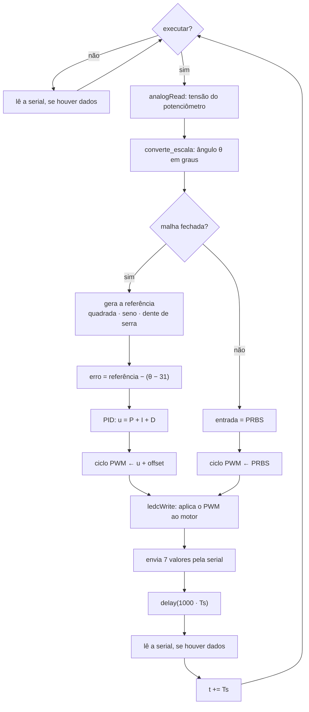
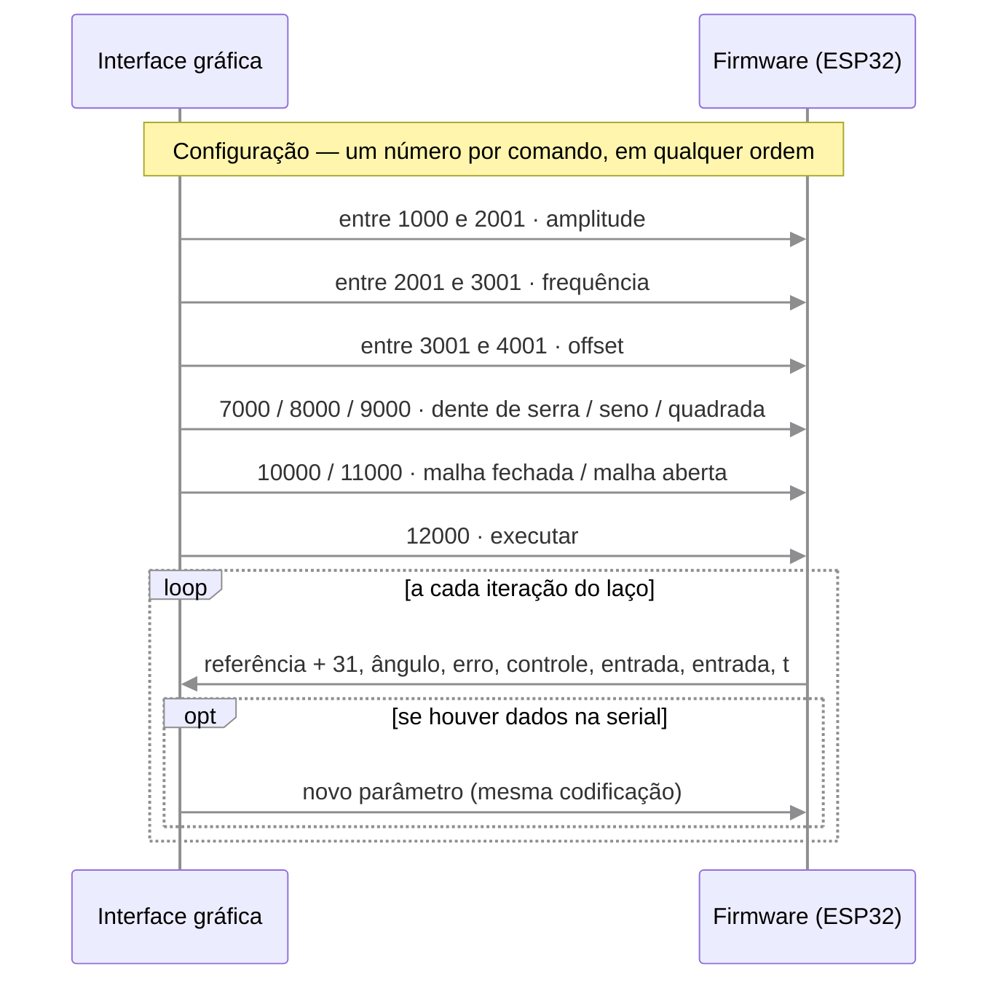

    

    
  
Figura 1 - Diagrama de blocos do Sistema em Malha Fechada.

 

## O que é

O firmware do Aeropêndulo foi desenvolvido em bibliotecas separadas por funcionalidade,
tornando o projeto mais flexível — cada parte pode ser atualizada ou substituída sem
interferir na lógica do arquivo principal (`main.cpp`).

O desenvolvimento usa o [PlatformIO](https://platformio.org/), ferramenta multiplataforma
que centraliza a programação de diferentes microcontroladores (ESP32, família Arduino,
STM32, entre outros), tornando o projeto mais portável.

## Bibliotecas

- **`ler_escrever_serial`** — configura os parâmetros do sinal de referência em tempo real e
  envia os estados do sistema pela porta serial, centralizando a comunicação com o
  computador sem misturar essa lógica ao `main.cpp`.
- **`referencia`** — implementa os sinais de referência que o controlador rastreia em malha
  fechada: onda quadrada, onda senoidal e onda dente de serra, cada um configurável em
  amplitude, frequência e offset. Novos sinais podem ser adicionados como módulos
  independentes.
- **`conversor`** — reúne as conversões de grandezas usadas no firmware: sinal do
  potenciômetro para ângulo, sinal de controle para ciclo PWM, grau para radiano e radiano
  para grau.
- **`controlador_pid`** — implementa o controlador PID usado quando a interface gráfica está
  configurada para malha fechada.

## Arquivo principal (`main.cpp`)

O PlatformIO organiza o projeto em bibliotecas mais um arquivo `main.cpp`, que importa essas
bibliotecas e implementa o algoritmo principal. No caso do Aeropêndulo, o `main.cpp` reúne:
geração do sinal de referência, leitura do sensor (potenciômetro), envio e recebimento de
dados pela porta serial, e execução do controlador.

Com o firmware pronto, a gravação no ESP32 é feita pelo próprio PlatformIO, que compila o
código e grava no microcontrolador via porta serial.

## Um ciclo do laço principal

Enquanto a interface não envia o comando de execução, o `loop()` só verifica se chegaram
dados pela serial. Depois do comando, cada iteração segue o caminho abaixo — o ramo de malha
fechada ou o de malha aberta, conforme a configuração recebida da interface:

O intervalo entre iterações é imposto pelo `delay(1000 · Ts)` no fim do laço, com
`Ts = 0,02` s; o tempo `t` enviado à interface avança de `Ts` em `Ts`.

## Protocolo serial

A comunicação usa 115200 baud. No sentido interface → firmware, cada comando é um único
número, lido com `Serial.parseFloat()` e interpretado pela faixa em que cai: três faixas
carregam valores contínuos (amplitude, frequência e offset, reescalados no firmware) e os
demais são códigos fixos. No sentido firmware → interface, cada iteração envia uma linha com
7 valores separados por vírgula — a mesma ordem das colunas descrita em
[Excitação e Aquisição](../identificacao/excitacao.md#formato-dos-dados-coletados).

Não existe código de parada: uma vez recebido o `12000`, o firmware continua executando o
laço até ser reiniciado. Os ganhos do PID também não fazem parte do protocolo — são fixos
no código (ver [Controlador PID](../controle/pid.md#ganhos)).

 