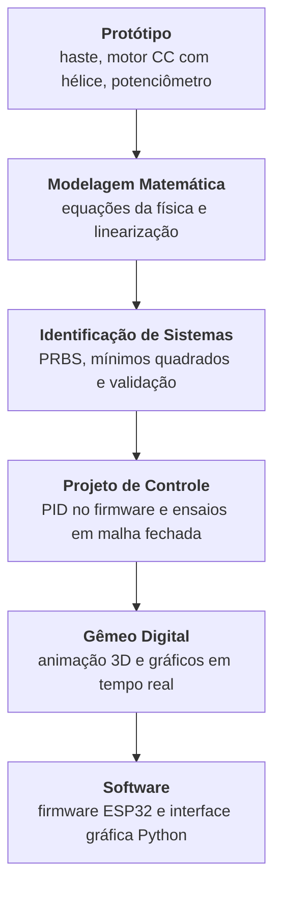

# O que é o Laboratório Virtual

## O problema

Ensinar sistemas de controle esbarra num obstáculo recorrente: a transição do mundo físico
para o mundo matemático abstrato. Equações diferenciais, transformadas de Laplace e
funções de transferência descrevem bem a dinâmica de um sistema, mas para quem está tendo
o primeiro contato com a área essa abstração pode parecer distante da realidade observada.
Protótipos e simuladores ajudam a fechar essa lacuna: permitem observar, no mundo real e no
computacional, a mesma dinâmica que a teoria descreve no papel.

A planta escolhida para este laboratório foi um **aeropêndulo**: uma haste articulada em um
pivô, com um motor CC e hélice acoplados à extremidade. O empuxo gerado pela hélice produz
torque em torno do pivô e eleva a haste a partir do repouso; a variável controlada é o
ângulo da haste em relação à vertical. É uma planta de primeira escolha para ensino por ser
não linear, pouco amortecida — no modelo linearizado, $\zeta \approx 0{,}11$ — e de
construção acessível.

## O que este projeto entrega

O laboratório é composto por quatro subsistemas que operam de forma integrada:

<figure class="lv-aeropendulo-figure" markdown="span">
  

<svg viewBox="20 0 190 200" width="480" xmlns="http://www.w3.org/2000/svg">
  <!-- Envelope dinâmico de oscilação angular -->
  <path d="M 110.4 100.7 A 60.6 60.6 0 0 0 163.6 100.7" fill="none" stroke="#D0D0D4" stroke-width="0.5" stroke-dasharray="2.5,2.5" />
  <line x1="137" y1="46.2" x2="110.4" y2="100.7" stroke="#E0E0E4" stroke-width="0.4" stroke-dasharray="1.5,2.5" />
  <line x1="137" y1="46.2" x2="163.6" y2="100.7" stroke="#E0E0E4" stroke-width="0.4" stroke-dasharray="1.5,2.5" />

  <!-- 1. BASE HEXAGONAL -->
  <polygon points="58,154 78,142 144,142 166,154 144,166 78,166" fill="#F0F0F2" stroke="#1D1D1F" stroke-width="1.0" stroke-linejoin="round" />
  <polygon points="58,154 78,166 78,170 58,158" fill="#D8D8DA" stroke="#1D1D1F" stroke-width="1.0" stroke-linejoin="round" />
  <polygon points="78,166 144,166 144,170 78,170" fill="#E3E3E5" stroke="#1D1D1F" stroke-width="1.0" stroke-linejoin="round" />
  <polygon points="144,166 166,154 166,158 144,170" fill="#C9C9CB" stroke="#1D1D1F" stroke-width="1.0" stroke-linejoin="round" />
  <line x1="38" y1="154" x2="186" y2="154" stroke="#BBBBBC" stroke-width="0.5" stroke-dasharray="3,2" />
  <line x1="58" y1="154" x2="166" y2="154" stroke="#BBBBBC" stroke-width="0.6" stroke-dasharray="3,2" />
  <line x1="110" y1="138" x2="110" y2="178" stroke="#D0D0D4" stroke-width="0.4" stroke-dasharray="2,2" />
  <circle cx="110" cy="154" r="1.5" fill="#1D1D1F" />
  <!-- Cota D -->
  <line x1="58" y1="180" x2="166" y2="180" stroke="#8A8A8C" stroke-width="0.5" />
  <line x1="58" y1="172" x2="58" y2="183" stroke="#8A8A8C" stroke-width="0.5" />
  <line x1="166" y1="156" x2="166" y2="183" stroke="#8A8A8C" stroke-width="0.5" />
  <rect x="101" y="181.5" width="22" height="7" fill="#F7F7F9" />
  <text x="112" y="187" font-size="6" font-weight="600" fill="#1D1D1F" font-family="IBM Plex Mono" text-anchor="middle">D=220</text>

  <!-- 2. REFORÇO TRIANGULAR + MASTRO -->
  <polygon points="68,154 98,154 98,82" fill="#E3E3E5" stroke="#1D1D1F" stroke-width="1.1" />
  <line x1="78" y1="154" x2="98" y2="116" stroke="#C9C9CB" stroke-width="0.7"/>
  <line x1="88" y1="154" x2="98" y2="136" stroke="#C9C9CB" stroke-width="0.7"/>
  <line x1="68" y1="154" x2="108" y2="58" stroke="#D0D0D4" stroke-width="0.4" stroke-dasharray="2,3" />
  <rect x="98" y="44" width="7" height="110" fill="#E3E3E5" stroke="#1D1D1F" stroke-width="1.1" />
  <line x1="101.5" y1="28" x2="101.5" y2="175" stroke="#C0C0C4" stroke-width="0.4" stroke-dasharray="3,3" />
  <!-- Cota H -->
  <line x1="48" y1="44" x2="48" y2="154" stroke="#8A8A8C" stroke-width="0.5" />
  <line x1="45" y1="44" x2="96" y2="44" stroke="#8A8A8C" stroke-width="0.5" stroke-dasharray="1.5,1.5" />
  <line x1="45" y1="154" x2="58" y2="154" stroke="#8A8A8C" stroke-width="0.5" />
  <rect x="31" y="95" width="16" height="7" fill="#F7F7F9" />
  <text x="39" y="101" font-size="6" font-weight="600" fill="#1D1D1F" font-family="IBM Plex Mono" text-anchor="middle">H=300</text>

  <!-- 3. TRAVESSA HORIZONTAL -->
  <line x1="85" y1="46.2" x2="155" y2="46.2" stroke="#BBBBBC" stroke-width="0.5" stroke-dasharray="3,2" />
  <rect x="96" y="43" width="45" height="6.5" rx="1.5" fill="#1D1D1F" stroke="#1D1D1F" stroke-width="1.0" />
  <circle cx="101.5" cy="46.2" r="1.2" fill="#F5F5F7" />
  <circle cx="137.5" cy="46.2" r="1.2" fill="#F5F5F7" />
  <!-- Cota W -->
  <line x1="96" y1="36" x2="141" y2="36" stroke="#8A8A8C" stroke-width="0.5" />
  <line x1="96" y1="33" x2="96" y2="43" stroke="#8A8A8C" stroke-width="0.5" />
  <line x1="141" y1="33" x2="141" y2="43" stroke="#8A8A8C" stroke-width="0.5" />
  <rect x="109" y="32.5" width="19" height="7" fill="#F7F7F9" />
  <text x="118.5" y="38" font-size="6" font-weight="600" fill="#1D1D1F" font-family="IBM Plex Mono" text-anchor="middle">W=45</text>

  <!-- 4. HASTE FIBRA DE CARBONO -->
  <rect x="136.1" y="6" width="1.8" height="96" rx="0.4" fill="#1D1D1F" />
  <!-- Cota L -->
  <line x1="172" y1="6" x2="172" y2="102" stroke="#8A8A8C" stroke-width="0.5" />
  <line x1="169" y1="6" x2="175" y2="6" stroke="#8A8A8C" stroke-width="0.5" />
  <line x1="169" y1="102" x2="175" y2="102" stroke="#8A8A8C" stroke-width="0.5" />
  <line x1="170" y1="46.2" x2="174" y2="46.2" stroke="#8A8A8C" stroke-width="0.5" stroke-dasharray="1.5,1.5" />
  <rect x="172" y="50" width="19" height="7" fill="#F7F7F9" />
  <text x="181.5" y="56" font-size="6" font-weight="600" fill="#1D1D1F" font-family="IBM Plex Mono" text-anchor="middle">L=96</text>

  <!-- 5. EIXO DE ROTAÇÃO / MANCAL -->
  <circle cx="137" cy="46.2" r="4.2" fill="#C9C9CB" stroke="#1D1D1F" stroke-width="1.1" />
  <circle cx="137" cy="46.2" r="2.0" fill="#1D1D1F" />
  <circle cx="137" cy="46.2" r="0.8" fill="#F5F5F7" />
  <line x1="137" y1="51" x2="137" y2="135" stroke="#8A8A8C" stroke-width="0.5" stroke-dasharray="3,3" />

  <!-- 6. MOTOR + HÉLICE -->
  <rect x="133" y="99" width="8" height="7" rx="1.5" fill="#1D1D1F" stroke="#1D1D1F" stroke-width="0.8" />
  <circle cx="137" cy="102.5" r="1.5" fill="#F5F5F7" />
  <path d="M 134 106 C 127 102.0, 116 100.5, 109 103.0 C 107.5 104.5, 108 106.5, 111 107.5 C 120 110.5, 129 109.0, 134 107.5 Z" fill="#1D1D1F" stroke="#1D1D1F" stroke-width="0.8" stroke-linejoin="round" />
  <path d="M 140 107.5 C 145 109.0, 154 110.5, 163 107.5 C 166 106.5, 166.5 104.5, 165 103.0 C 158 100.5, 147 102.0, 140 106.0 Z" fill="#1D1D1F" stroke="#1D1D1F" stroke-width="0.8" stroke-linejoin="round" />
  <path d="M 110.5 104 C 117 102.5, 126 104, 133.5 106.5" fill="none" stroke="#E3E3E5" stroke-width="1.0" stroke-linecap="round" />
  <path d="M 140.5 106.5 C 148 104, 157 102.5, 163.5 104" fill="none" stroke="#E3E3E5" stroke-width="1.0" stroke-linecap="round" />
  <circle cx="137" cy="106.8" r="28" fill="none" stroke="#BBBBBC" stroke-width="0.6" stroke-dasharray="2,3" />
  <line x1="95" y1="106.8" x2="179" y2="106.8" stroke="#D0D0D4" stroke-width="0.4" stroke-dasharray="3,2" />
  <line x1="137" y1="85" x2="137" y2="103" stroke="#BBBBBC" stroke-width="0.5" stroke-dasharray="2,2" />
  <circle cx="137" cy="106.8" r="3.6" fill="#1D1D1F" />
  <circle cx="137" cy="106.8" r="1.8" fill="#F5F5F7" />
  <circle cx="137" cy="106.8" r="0.8" fill="#1D1D1F" />
</svg>
  

  <figcaption>Figura — Ilustração técnica do aeropêndulo: base hexagonal de compensado naval (D = 220 mm), mastro (H = 300 mm), travessa de mancal (W = 45 mm), haste de fibra de carbono (L = 96 mm por lado do pivô) e conjunto motor/hélice na extremidade.</figcaption>
</figure>

| Subsistema | Função | Tecnologia |
| --- | --- | --- |
| **Protótipo** | Planta física: haste, motor CC com hélice, potenciômetro como sensor de ângulo, ponte H | Estrutura em madeira e fibra de carbono |
| **Firmware** | Leitura do sensor, controle PID em malha fechada, geração do sinal de referência e comunicação serial | C++ · ESP32 TTGO · PlatformIO |
| **Interface gráfica** | Aquisição em tempo real, visualização dos sinais e registro dos ensaios em CSV | Python · CustomTkinter · PySerial |
| **Gêmeo digital** | Réplica virtual do protótipo: animação tridimensional e gráficos atualizados com o ângulo medido | Python · VPython · Matplotlib |

O firmware e a interface gráfica trocam dados por porta serial: o microcontrolador envia
posição angular, referência, erro e sinal de controle; a interface envia comandos de
configuração e parâmetros do sinal de excitação (amplitude, frequência, offset, forma de
onda) e de operação (malha aberta/fechada, executar). Os ganhos do controlador PID são
fixos no firmware, definidos em tempo de compilação — mudá-los exige recompilar e
regravar o microcontrolador, não é feito pela interface. O gêmeo digital é opcional
(`python rungui.py -simular sim`) e depende desses dados: ele reproduz na tela o movimento
que o protótipo está fazendo, a partir do ângulo recebido pela serial, e não integra um
modelo por conta própria — sem o protótipo conectado, não há o que animar.

## O fluxo completo

Esta documentação segue o mesmo ciclo experimental adotado no desenvolvimento do
laboratório: parte-se da planta física, passa-se pela obtenção de um modelo matemático a
partir de dados experimentais e chega-se ao projeto e à validação de um controlador — tanto
no protótipo real quanto no gêmeo digital. Para acompanhar esse fluxo na ordem em que ele
acontece, siga [Protótipo](../prototipo/index.md) →
[Modelagem Matemática](../modelagem/index.md) →
[Identificação de Sistemas](../identificacao/excitacao.md) →
[Projeto de Controle](../controle/pid.md) →
[Gêmeo Digital](../gemeo-digital/index.md) →
[Software](../software/interface-grafica.md).

## Origem acadêmica

Este laboratório é o resultado do Trabalho de Conclusão de Curso de **Oséias Dias de
Farias**, em Engenharia Elétrica na Faculdade de Engenharia Elétrica da Universidade
Federal do Pará, Campus Universitário de Tucuruí, sob orientação do **Prof. Raphael Barros
Teixeira**. O trabalho foi defendido em 11 de dezembro de 2023 e está publicado em acesso
aberto na Biblioteca Digital de Monografias da UFPA, em
[bdm.ufpa.br/handle/prefix/6944](https://bdm.ufpa.br/handle/prefix/6944).
