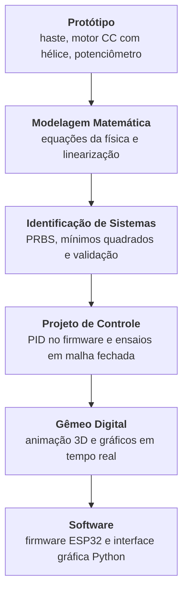

# O que é o Laboratório Virtual

## O problema

Ensinar sistemas de controle esbarra num obstáculo recorrente: a transição do mundo físico
para o mundo matemático abstrato. Equações diferenciais, transformadas de Laplace e
funções de transferência descrevem bem a dinâmica de um sistema, mas para quem está tendo
o primeiro contato com a área essa abstração pode parecer distante da realidade observada.
Protótipos e simuladores ajudam a fechar essa lacuna: permitem observar, no mundo real e no
computacional, a mesma dinâmica que a teoria descreve no papel.

A planta escolhida para este laboratório foi um **aeropêndulo**: uma haste articulada em um
pivô, com um motor CC e hélice acoplados à extremidade. O empuxo gerado pela hélice produz
torque em torno do pivô e eleva a haste a partir do repouso; a variável controlada é o
ângulo da haste em relação à vertical. É uma planta de primeira escolha para ensino por ser
não linear, instável em malha aberta em parte da faixa de operação e de construção
acessível.

## O que este projeto entrega

O laboratório é composto por quatro subsistemas que operam de forma integrada:

| Subsistema | Função | Tecnologia |
| --- | --- | --- |
| **Protótipo** | Planta física: haste, motor CC com hélice, potenciômetro como sensor de ângulo, ponte H | Estrutura em madeira e fibra de carbono |
| **Firmware** | Leitura do sensor, controle PID em malha fechada, geração do sinal de referência e comunicação serial | C++ · ESP32 TTGO · PlatformIO |
| **Interface gráfica** | Aquisição em tempo real, visualização dos sinais e registro dos ensaios em CSV | Python · CustomTkinter · PySerial |
| **Gêmeo digital** | Réplica virtual do protótipo: animação tridimensional e gráficos atualizados com o ângulo medido | Python · VPython · Matplotlib |

O firmware e a interface gráfica trocam dados por porta serial: o microcontrolador envia
posição angular, referência, erro e sinal de controle; a interface envia comandos de
configuração e parâmetros do sinal de excitação (amplitude, frequência, offset, forma de
onda) e de operação (malha aberta/fechada, executar). Os ganhos do controlador PID são
fixos no firmware, definidos em tempo de compilação — mudá-los exige recompilar e
regravar o microcontrolador, não é feito pela interface. O gêmeo digital é opcional
(`python rungui.py -simular sim`) e depende desses dados: ele reproduz na tela o movimento
que o protótipo está fazendo, a partir do ângulo recebido pela serial, e não integra um
modelo por conta própria — sem o protótipo conectado, não há o que animar.

## O fluxo completo

Esta documentação segue o mesmo ciclo experimental adotado no desenvolvimento do
laboratório: parte-se da planta física, passa-se pela obtenção de um modelo matemático a
partir de dados experimentais e chega-se ao projeto e à validação de um controlador — tanto
no protótipo real quanto no gêmeo digital. Para acompanhar esse fluxo na ordem em que ele
acontece, siga [Protótipo](../prototipo/index.md) →
[Modelagem Matemática](../modelagem/index.md) →
[Identificação de Sistemas](../identificacao/excitacao.md) →
[Projeto de Controle](../controle/pid.md) →
[Gêmeo Digital](../gemeo-digital/index.md) →
[Software](../software/interface-grafica.md).

## Origem acadêmica

Este laboratório é o resultado do Trabalho de Conclusão de Curso de **Oséias Dias de
Farias**, em Engenharia Elétrica na Faculdade de Engenharia Elétrica da Universidade
Federal do Pará, Campus Universitário de Tucuruí, sob orientação do **Prof. Raphael Barros
Teixeira**. O trabalho foi defendido em 11 de dezembro de 2023 e está publicado em acesso
aberto na Biblioteca Digital de Monografias da UFPA, em
[bdm.ufpa.br/handle/prefix/6944](https://bdm.ufpa.br/handle/prefix/6944).
